# Diagrama do Banco — `coleta_imobiliaria` (estado atual)

Após Etapas A/B (dedup `usuarios`, `pessoa_alias`, `vendas` canônica, `fato_*`).
Renderiza no VS Code (Markdown Preview Mermaid) e no GitHub.

**Legenda:** linha **sólida** `--` = FK real no banco · linha **tracejada** `..` = relação
**por valor (sem FK)** · `PK` chave primária · `UK` única · `FK` chave estrangeira.

> 47 tabelas em 7 domínios. `imoveis` (scraping, 7M linhas) é domínio separado do operacional.

```mermaid
erDiagram
  %% ───────── 1. PESSOAS & EQUIPES ─────────
  usuarios {
    int id PK
    string id_usuarios UK
    string nome
    string team FK
    string permissao
    string id_imoview
  }
  equipes {
    string id_equipe PK
    string nome
    string email
  }
  pessoa_alias {
    int id PK
    string alias_key UK
    string id_usuarios
    string origem
  }
  usuarios_dup_backup {
    string id_usuarios
    string nome
    timestamp backup_em
  }

  %% ───────── 2. VENDAS / COMISSAO ─────────
  vendas {
    int id PK
    string fonte
    string id_contrato
    date data_venda
    numeric valor_negocio
    string vendedor_id FK
    string captador_id FK
    string gerente_venda_id FK
    string gerente_captacao_id FK
    string diretor_id FK
  }
  contratos {
    string id_contrato PK
    date data_contrato
    string codigo_imovel
    string gerente_venda_nome
    string diretor_nome
  }
  vendas_legado {
    int id PK
    date data_venda
    string idcontrato
    string vendedor_1
    string captador_1
  }
  divisao_comissao {
    int id PK
    string id_contrato
    string id_corretor
    string nome_corretor
  }
  recebidos_legado {
    int id PK
    date data
    string contrato
  }

  %% ───────── 3. CAPTACAO (jornada) ─────────
  captacao {
    int id PK
    string id_corretor
    string nome_corretor
    string team
    string status
  }
  captacao_historico {
    int id PK
    int captacao_id
    string etapa
  }
  cliente_acao {
    int id PK
  }

  %% ───────── 4. FATOS IMOVEL / BI ─────────
  fato_captacao {
    int id PK
    string codigo_imovel
    string captador1
    string id_gerente
    string bairro_id
    string tipo_id
  }
  fato_saida {
    int id PK
    string codigo_imovel
    string id_gerente
  }
  fato_estoque {
    int id PK
    string codigo_imovel
    string id_gerente
  }
  fato_destaque {
    int id PK
    string codigo_imovel
    string id_gerente
  }
  eventos_imovel_legado {
    int id PK
    string tipo_evento
    string codigo_imovel
    string captador1
    string id_gerente
  }
  imoveis_legado {
    int id PK
    string codigo
    string tipo FK
    string bairro FK
    bool foco_pp
  }
  bairros_legado {
    int id PK
    string id_bairro UK
    string nome
  }
  tipos_imovel_legado {
    int id PK
    string id_tipo UK
    string nome
  }
  nichos_legado {
    int id PK
    string corretor
    string gerente
  }
  metas_mensais_legado {
    int id PK
    date mes
    string id_gerente
  }
  campanhas_legado {
    int id PK
    string id_anuncio
  }
  anuncios_imovel_legado {
    int id PK
    string id_anuncio
    string cod
  }
  portais_legado {
    int id PK
  }
  fontes_legado {
    int id PK
    string codigo
  }
  atendimentos_legado {
    int id PK
    string codigo
  }
  diretores_legado {
    int id PK
    string id_diretor
    string nome
  }

  %% ───────── 5. VISITAS ─────────
  visitas {
    int id PK
    string id_visita UK
    date data_visita
    string id_cliente_assinante FK
    string id_parceiro FK
  }
  clientes_visita {
    string id_cliente PK
    string nome
  }
  parceiros_visita {
    string id_parceiro PK
    string nome
  }
  visita_cliente {
    int id PK
    string id_visita FK
    string id_cliente FK
  }
  visita_parceiro {
    int id PK
    string id_visita FK
    string id_parceiro FK
  }
  avaliacoes_visita {
    int id PK
    string id_visita FK
    string id_cliente FK
    string id_parceiro FK
  }
  gerente_visita_visualizada {
    int id PK
  }
  relatorios_imovel_legado {
    int id PK
    string id_relatorio
    string id_imovel
  }
  sessoes_usuario_legado {
    int id PK
    string id_corretor
  }
  menus_legado {
    int id PK
    string tipo_menu
  }
  admins_legado {
    int id PK
    string email
  }

  %% ───────── 6. LEADS / CRM ─────────
  leads {
    int id PK
  }
  contatos {
    int id PK
    int lead_id FK
  }
  logestagios {
    int id PK
    int lead_id FK
  }
  leads_legado {
    int id PK
    date data
    string codigo_imovel
    string equipe
  }
  clientes_legado {
    int id PK
    string cpf
    string id_contrato
  }

  %% ───────── 7. COLETA DE MERCADO (scraping) ─────────
  imoveis {
    int id PK
    string codigo
    string bairro
    int preco
  }
  imoveis_venda {
    int id PK
    int cluster
  }
  imoveis_aluguel {
    int id PK
    int cluster
  }
  coleta_geral {
    int id PK
  }
  performe_imoveis {
    int id PK
  }

  %% ═════════ RELACOES — FK REAIS (solido) ═════════
  usuarios   ||--o{ vendas : "vendedor_id"
  usuarios   ||--o{ vendas : "captador_id"
  usuarios   ||--o{ vendas : "gerente_venda_id"
  usuarios   ||--o{ vendas : "gerente_captacao_id"
  usuarios   ||--o{ vendas : "diretor_id"
  tipos_imovel_legado ||--o{ imoveis_legado : "tipo"
  bairros_legado      ||--o{ imoveis_legado : "bairro"
  imoveis    ||--|| imoveis_venda : "subtipo"
  imoveis    ||--|| imoveis_aluguel : "subtipo"
  visitas    ||--o{ visita_cliente : ""
  clientes_visita ||--o{ visita_cliente : ""
  visitas    ||--o{ visita_parceiro : ""
  parceiros_visita ||--o{ visita_parceiro : ""
  visitas    ||--o{ avaliacoes_visita : ""
  clientes_visita ||--o{ avaliacoes_visita : ""
  parceiros_visita ||--o{ avaliacoes_visita : ""
  clientes_visita ||--o{ visitas : "assinante"
  parceiros_visita ||--o{ visitas : ""
  leads      ||--o{ contatos : ""
  leads      ||--o{ logestagios : ""

  %% ═════════ RELACOES — POR VALOR, SEM FK (tracejado) ═════════
  equipes  ||..o{ usuarios : "team"
  usuarios ||..o{ pessoa_alias : "id_usuarios"
  usuarios ||..o{ captacao : "id_corretor"
  equipes  ||..o{ captacao : "team"
  captacao ||..o{ captacao_historico : "captacao_id"
  usuarios ||..o{ divisao_comissao : "id_corretor"
  vendas   ||..o{ divisao_comissao : "id_contrato"
  contratos ||..o{ vendas : "fonte 2024 em diante"
  vendas_legado ||..o{ vendas : "fonte ate 2023"
  usuarios ||..o{ eventos_imovel_legado : "captador/gerente"
  usuarios ||..o{ fato_captacao : "captador/gerente"
  usuarios ||..o{ fato_saida : "captador/gerente"
  usuarios ||..o{ fato_estoque : "captador/gerente"
  usuarios ||..o{ fato_destaque : "captador/gerente"
  imoveis_legado ||..o{ fato_captacao : "codigo"
  imoveis_legado ||..o{ eventos_imovel_legado : "codigo"
  equipes  ||..o{ metas_mensais_legado : "id_gerente"
  anuncios_imovel_legado ||..o{ campanhas_legado : "id_anuncio"
```

## Notas
- **`usuarios.id_usuarios`** agora é único (`uq_usuarios_id_usuarios`) → virou alvo de FK
  (usado por `vendas`). `pessoa_alias` resolve nome/código → `id_usuarios`.
- **`vendas`** é a camada canônica (2015→hoje); `contratos`/`vendas_legado` são as fontes
  brutas (linhagem tracejada). `divisao_comissao` deve passar a referenciar `vendas.id_contrato`.
- **`fato_*`** (correntes) e **`eventos_imovel_legado`** (histórico) guardam `captador*`/`id_gerente`
  por valor → candidatos a FK depois de resolver o de-para (Etapa C/D do MAPA_BANCO.md).
- **`imoveis`** (7M) + `imoveis_venda/aluguel` = scraping de mercado, isolado do operacional.
- `usuarios_dup_backup` = backup do dedup (não relaciona; arquivo de segurança).
