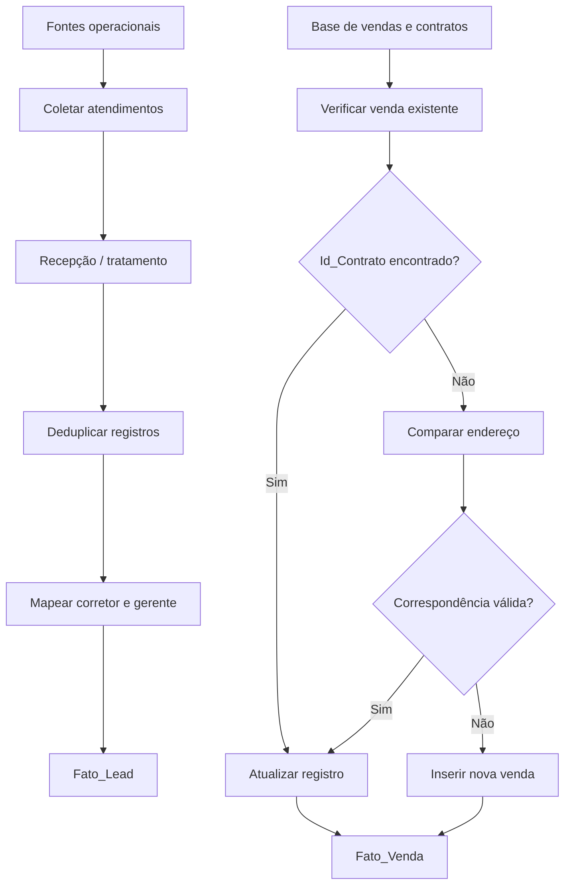
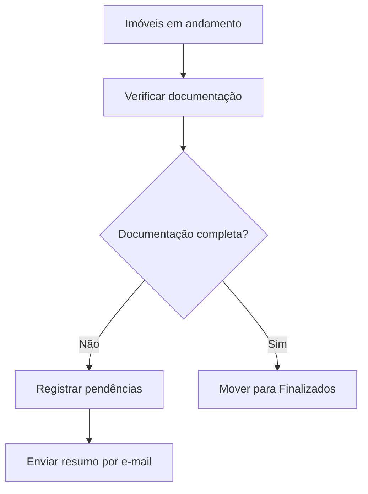
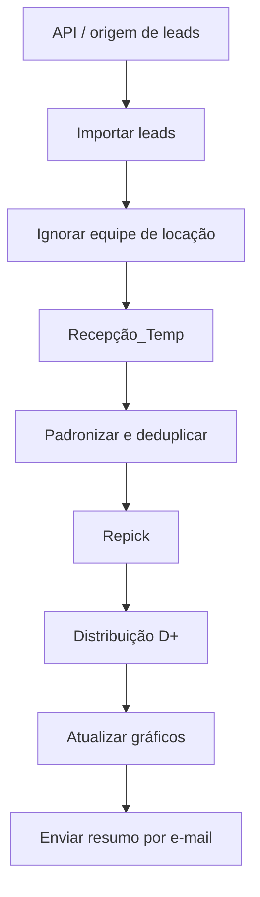
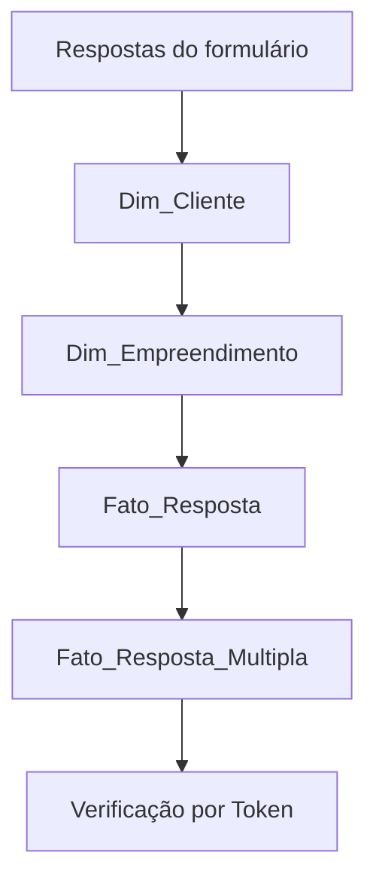

# Acionadores e Processos — Base Inteligente

**Organização:** 61 Imóveis  
**Data da documentação:** 13/07/2026  
**Escopo:** acionadores exibidos no painel do Google Apps Script e funções relacionadas aos projetos operacionais da 61 Imóveis.

---

## 1. Objetivo

Este documento registra:

- quais planilhas e projetos possuem acionadores;
- qual função é executada por cada acionador;
- o evento que inicia a execução;
- o processo operacional executado;
- as principais entradas, saídas e regras de negócio conhecidas;
- os riscos identificados pela taxa de erros;
- o procedimento de acompanhamento e correção.

> **Importante:** algumas funções foram documentadas com base em códigos e fluxos já trabalhados anteriormente. Quando o código-fonte completo da função não estava disponível, o comportamento foi marcado como **parcialmente confirmado** ou **pendente de validação**.

---

## 2. Legenda de confiabilidade

| Classificação | Significado |
|---|---|
| **Confirmado** | O comportamento foi identificado em código, logs ou fluxo operacional já analisado. |
| **Parcialmente confirmado** | A finalidade está clara, mas faltam partes do código para confirmar todas as colunas, regras ou destinos. |
| **Pendente de validação** | O inventário confirma a função e o acionador, mas o código-fonte não foi disponibilizado para detalhamento técnico. |

---

## 3. Inventário geral dos acionadores

Todos os acionadores apresentados estão vinculados à implantação **Teste**.

| Planilha / arquivo | Projeto Apps Script | Função | Evento | Última execução observada | Taxa de erros | Situação |
|---|---|---|---|---|---:|---|
| PreencherBase | PreencherBase | `onOpen` | Da planilha — Ao abrir | Sem execução registrada | — | Sem histórico |
| Solicitações - 61 (Respostas) | Solicitações 61 | `mainWork` | De acordo com o horário | 13/07/2026 13:37:19 | 0% | Operacional |
| CONTROLE DE QUALIDADE - 2023 | Projeto sem título | `finalizarImoveis` | De acordo com o horário | 13/07/2026 06:47:22 | 100% | **Crítico** |
| CONTROLE DE QUALIDADE - 2023 | Projeto sem título | `verificarDocumentacoesEEnviarEmail` | De acordo com o horário | 13/07/2026 07:49:15 | 100% | **Crítico** |
| Cópia de Base Inteligência 61 | Gestão de dados | `coletarAtendimentos` | De acordo com o horário | 12/07/2026 17:50:09 | 0% | Operacional |
| Cópia de Base Inteligência 61 | Gestão de dados | `transferirDadosDaRecepcaoParaFatoLead` | De acordo com o horário | 12/07/2026 18:49:30 | 0% | Operacional |
| Base Inteligência 61 | Gestão de dados | `showMainMenu` | Da planilha — Ao abrir | 13/07/2026 13:43:27 | 0% | Operacional |
| Base Inteligência 61 | Gestão de dados | `verifyAndSyncFatoVendaFromVendas` | De acordo com o horário | 13/07/2026 12:40:22 | 35,71% | **Instável** |
| CONTROLE DE QUALIDADE - 2024 | Verificar Documentações | `verificarDocumentacoes` | De acordo com o horário | 13/07/2026 06:04:00 | 100% | **Crítico** |
| CONTROLE DE QUALIDADE - 2024 | Verificar Documentações | `verificarDocumentacoesEEnviarEmail` | De acordo com o horário | 13/07/2026 07:46:34 | 100% | **Crítico** |
| Cópia de CONTROLE DE LEADS COMPRA E VENDA | PreencherBase | `transferirDados` | De acordo com o horário | 10/07/2026 13:37:52 | 0% | Operacional |
| Controle de Contratos 61 Imóveis 2024 OFICIAL | Projeto sem título | `transferData` | De acordo com o horário | 13/07/2026 12:50:02 | 18,52% | **Atenção** |
| ValoresRecebidos_Contratos61_Obsoleto | Lancamento_Contratos | `showForm` | Da planilha — Ao abrir | 10/07/2026 16:46:51 | 0% | Obsoleto, mas ativo |
| Teste_Respostas acelera | ETL_Form_Acelera_Teste | `executarTodasAsExtracoes` | De acordo com o horário | 13/07/2026 12:30:41 | 0% | Operacional |
| CONTROLE DE LEADS COMPRA E VENDA | PreencherBase | `importarLeadsParaPlanilha` | De acordo com o horário | 13/07/2026 05:00:20 | 0% | Operacional |
| CONTROLE DE LEADS COMPRA E VENDA | PreencherBase | `enviarEmailLeads` | De acordo com o horário | 13/07/2026 06:29:15 | 0% | **Possivelmente redundante** |
| CONTROLE DE LEADS COMPRA E VENDA | PreencherBase | `showMainMenu` | Da planilha — Ao abrir | 10/07/2026 15:08:13 | 0% | Operacional |
| Cópia de Base Inteligência 61 | Gestão de dados | `setMenuContent` | Da planilha — Ao abrir | Sem execução registrada | — | Sem histórico |

> O painel apresenta apenas “De acordo com o horário”. O horário exato configurado em cada acionador não está visível na captura e deve ser consultado na edição individual do gatilho.

---

# 4. Processos detalhados

## 4.1. Base Inteligência 61 — Gestão de dados

### 4.1.1. `showMainMenu`

**Tipo de acionamento:** ao abrir a planilha.  
**Confiabilidade:** Confirmado.

### Finalidade

Disponibilizar a interface de operação da Base Inteligência 61 assim que o usuário abre a planilha.

### Processo

1. O usuário abre a Base Inteligência 61.
2. O acionador executa `showMainMenu`.
3. O Apps Script carrega a interface HTML ou menu principal.
4. O usuário acessa as funcionalidades de cadastro e movimentação de dados.

### Funcionalidades historicamente associadas ao menu

- cadastro de clientes;
- estoque de imóveis;
- leads compradores;
- leads vendedores;
- agenda de visitas;
- formulários de entrada e saída de imóveis;
- rotinas de atualização das tabelas fato e dimensões.

### Entrada

Abertura da planilha pelo usuário.

### Saída

Menu, janela modal ou interface HTML disponibilizada na planilha.

### Pontos de controle

- verificar se os arquivos HTML referenciados existem;
- verificar se o usuário possui permissão para abrir a interface;
- evitar que a abertura do menu dependa de funções demoradas;
- manter o `onOpen` separado das rotinas de processamento pesado.

---

### 4.1.2. `verifyAndSyncFatoVendaFromVendas`

**Tipo de acionamento:** baseado em tempo.  
**Taxa de erros observada:** **35,71%**.  
**Confiabilidade:** Parcialmente confirmado.

### Finalidade

Sincronizar os contratos ou vendas registrados na base operacional de vendas com a tabela `Fato_Venda` da Base Inteligência 61.

### Processo conhecido

1. Abrir a planilha ou aba de origem que contém os registros de vendas.
2. Ler os contratos registrados na origem.
3. Verificar se o registro já existe na `Fato_Venda`.
4. Utilizar preferencialmente o `Id_Contrato` como identificador.
5. Quando o identificador estiver ausente, utilizar o endereço do imóvel como chave auxiliar.
6. Se uma linha correspondente já existir e estiver sem `Id_Contrato`, completar o identificador.
7. Se a venda ainda não existir, inserir uma nova linha.
8. Atualizar os campos necessários sem criar uma segunda venda para o mesmo contrato.
9. Registrar no log quantos registros foram inseridos, atualizados, ignorados ou rejeitados.

### Regras conhecidas

- `Id_Contrato` deve ser a chave principal sempre que estiver preenchido.
- A comparação por endereço deve utilizar texto padronizado e idêntico entre origem e destino.
- O endereço é apenas uma chave de contingência, pois imóveis diferentes podem ter descrições semelhantes.
- Uma venda não deve ser duplicada quando já existir uma linha correspondente.
- Campos de vendedor e captador precisam manter os IDs ou nomes conforme o padrão da `Fato_Venda`.

### Entrada

Dados da tabela de vendas/contratos.

### Saída

Registros inseridos ou atualizados na `Fato_Venda`.

### Riscos atuais

- duplicidade de contrato;
- endereço com grafia diferente;
- `Id_Contrato` vazio;
- diferença de quantidade de colunas entre origem e destino;
- data ou valor em formato inválido;
- alteração de cabeçalho;
- timeout em execução com muitas linhas;
- falha de acesso entre planilhas.

### Ações recomendadas

- registrar o número da linha que falhou;
- registrar o `Id_Contrato` e o endereço no erro;
- processar em lote com `getValues()` e `setValues()`;
- usar `LockService` para impedir duas sincronizações simultâneas;
- manter uma aba de auditoria da sincronização;
- investigar prioritariamente a taxa atual de 35,71%.

---

## 4.2. Cópia de Base Inteligência 61 — Gestão de dados

### 4.2.1. `coletarAtendimentos`

**Tipo de acionamento:** baseado em tempo.  
**Taxa de erros observada:** 0%.  
**Confiabilidade:** Parcialmente confirmado.

### Finalidade

Coletar registros de atendimento ou recepção e prepará-los para consolidação e posterior envio à tabela `Fato_Lead`.

### Processo esperado

1. Acessar a fonte de atendimentos.
2. Ler os registros ainda não consolidados.
3. Padronizar datas, cliente, telefone, código do imóvel, portal, corretor e gerente.
4. Gravar os dados na área de recepção ou processamento.
5. Disponibilizar os registros para `transferirDadosDaRecepcaoParaFatoLead`.

### Entrada

Registros de atendimento oriundos da recepção, formulário, CRM ou outra base operacional.

### Saída

Base intermediária de atendimentos pronta para tratamento.

### Pendente de validação no código-fonte

- planilha e aba exatas de origem;
- janela de datas;
- colunas coletadas;
- regra para considerar um atendimento novo;
- existência de API externa;
- tratamento de paginação;
- exclusão ou marcação após a coleta.

---

### 4.2.2. `transferirDadosDaRecepcaoParaFatoLead`

**Tipo de acionamento:** baseado em tempo.  
**Taxa de erros observada:** 0%.  
**Confiabilidade:** Confirmado.

### Finalidade

Limpar, deduplicar, transformar e transferir os registros da recepção para a tabela `Fato_Lead` da Base Inteligência 61.

### Processo

1. Ler todos os registros da base de recepção.
2. Ignorar o cabeçalho.
3. Padronizar os campos relevantes.
4. Criar uma chave de deduplicação utilizando:

   ```text
   cliente | telefone | código do imóvel | portal
   ```

5. Manter somente o primeiro registro de cada chave.
6. Separar os registros duplicados em uma aba específica.
7. Gravar os registros únicos na aba principal de tratamento.
8. Formatar a coluna de data no padrão `DD/MM/YYYY`.
9. Abrir a Base Inteligência 61.
10. Ler as dimensões de corretores e gerentes.
11. Converter nomes para os IDs ou valores padronizados utilizados pela base.
12. Inserir os novos registros no final da aba `Fato_Lead`.
13. Registrar em log:
    - quantidade de registros únicos;
    - quantidade de duplicados;
    - aba atualizada;
    - início e término da transferência;
    - erro encontrado, quando houver.

### Entrada

Base de recepção com atendimentos e leads.

### Saídas

- registros únicos na `Fato_Lead`;
- registros repetidos em uma aba de duplicados;
- logs de quantidade e execução.

### Regras relevantes

- não duplicar o mesmo conjunto cliente, telefone, imóvel e portal;
- preservar registros sem código quando houver informação suficiente do cliente;
- mapear corretamente corretor e gerente;
- não apagar a origem antes da confirmação da gravação;
- apendar os registros após a última linha da `Fato_Lead`.

### Riscos

- ausência de dimensão para o corretor ou gerente informado;
- números de telefone em formatos diferentes;
- mesmo cliente escrito de formas diferentes;
- colunas deslocadas na recepção;
- gravação parcial em caso de erro;
- repetição da mesma carga em execuções subsequentes.

---

### 4.2.3. `setMenuContent`

**Tipo de acionamento:** ao abrir a planilha.  
**Confiabilidade:** Parcialmente confirmado.

### Finalidade

Montar ou atualizar o conteúdo de menu da cópia da Base Inteligência 61.

### Processo esperado

1. A planilha é aberta.
2. O acionador chama `setMenuContent`.
3. A função cria ou atualiza os itens do menu personalizado.
4. Os itens são vinculados às funções de coleta, transferência, formulários ou manutenção.

### Situação

Não há última execução registrada na captura. Verificar se:

- o acionador está autorizado;
- o usuário abriu a planilha após a criação do gatilho;
- a função ainda existe com exatamente o mesmo nome;
- o menu não está sendo criado por outro `onOpen`.

---

## 4.3. Controle de Contratos 61 Imóveis 2024 OFICIAL

### 4.3.1. `transferData`

**Tipo de acionamento:** baseado em tempo.  
**Taxa de erros observada:** **18,52%**.  
**Confiabilidade:** Parcialmente confirmado.

### Finalidade

Transferir ou consolidar dados da base operacional de contratos e vendas para uma estrutura de controle, relatório ou base de destino.

### Contexto da base

A base de contratos registra informações como:

- `Id_Contrato`;
- data do contrato;
- descrição do contrato;
- valor do negócio;
- valor da comissão;
- valor total da 61;
- nota fiscal;
- percentuais de empresa, diretor, gerente e corretores;
- vendedores e captadores;
- compradores e vendedores do imóvel;
- assinatura, escritura, quitação e posse;
- parcelas de comissão;
- anexos;
- origem do lead;
- bairro, tipo e código do imóvel.

### Processo esperado

1. Ler os registros da aba operacional de vendas/contratos.
2. Validar campos obrigatórios.
3. Identificar contratos novos ou alterados.
4. Transformar os dados para o formato exigido no destino.
5. Transferir ou atualizar os registros.
6. Manter a ordem correta das colunas.
7. Registrar contratos ignorados ou rejeitados.
8. Finalizar com resumo de inserções, atualizações e erros.

### Pontos que exigem validação no código

- nome exato da aba de origem;
- nome exato da aba de destino;
- chave de atualização;
- se a rotina limpa e reconstrói o destino ou apenas apenda;
- filtros de data;
- tratamento de contratos cancelados;
- tratamento de anexos;
- regra de duplicidade.

### Riscos atuais

- cabeçalhos renomeados;
- número diferente de colunas;
- datas em texto;
- percentuais ou valores monetários inválidos;
- contrato sem `Id_Contrato`;
- duplicidade;
- anexos ou URLs inválidos;
- fórmulas no destino;
- timeout.

### Prioridade

A taxa de erros de 18,52% exige análise dos registros de execução antes que a falha evolua para perda ou atraso de dados.

---

## 4.4. CONTROLE DE QUALIDADE — 2023

### 4.4.1. `finalizarImoveis`

**Tipo de acionamento:** baseado em tempo.  
**Taxa de erros observada:** **100%**.  
**Confiabilidade:** Confirmado quanto ao fluxo principal.

### Finalidade

Mover imóveis que concluíram a verificação documental da aba `Em Andamento` para a aba `Finalizados`.

### Processo

1. Abrir a aba `Em Andamento`.
2. Ler as linhas cadastradas.
3. Percorrer os registros de baixo para cima.
4. Para cada linha, chamar a função de validação documental.
5. Quando a documentação estiver completa:
   - adicionar a linha à lista de finalizados;
   - remover a linha da aba `Em Andamento`.
6. Gravar as linhas aprovadas na aba `Finalizados`.
7. Preservar os cabeçalhos.
8. Ajustar a quantidade de colunas quando origem e destino não tiverem exatamente a mesma estrutura.

### Motivo para percorrer de baixo para cima

Ao excluir linhas durante o processamento, a numeração das linhas seguintes muda. O percurso inverso evita que uma linha seja pulada.

### Principais causas possíveis para erro de 100%

- aba `Em Andamento` não encontrada;
- aba `Finalizados` não encontrada;
- função auxiliar de validação inexistente ou renomeada;
- quantidade de colunas diferente;
- tentativa de gravar uma matriz vazia;
- linha com tipo de dado inesperado;
- proteção da planilha;
- falta de autorização;
- limite de tempo excedido.

---

### 4.4.2. `verificarDocumentacoesEEnviarEmail`

**Tipo de acionamento:** baseado em tempo.  
**Taxa de erros observada:** **100%**.  
**Confiabilidade:** Parcialmente confirmado.

### Finalidade

Verificar a situação documental dos imóveis e enviar uma comunicação com as pendências ou resultados.

### Processo esperado

1. Ler os imóveis em acompanhamento.
2. Verificar os campos documentais obrigatórios.
3. Classificar cada imóvel como:
   - documentação completa;
   - documentação pendente;
   - documentação inconsistente.
4. Montar um resumo das pendências.
5. Enviar o resumo por e-mail.
6. Registrar no log o número de imóveis analisados e notificados.

### Pendente de validação

- colunas obrigatórias;
- destinatários;
- assunto do e-mail;
- conteúdo do corpo;
- regra de reenvio;
- se imóveis completos são movidos para `Finalizados`;
- se há planilha de histórico de notificações.

### Situação crítica

Como a taxa está em 100%, a rotina não está cumprindo sua finalidade. Deve ser analisada junto com `finalizarImoveis`, pois ambas podem depender da mesma função auxiliar ou estrutura de abas.

---

## 4.5. CONTROLE DE QUALIDADE — 2024

### 4.5.1. `verificarDocumentacoes`

**Tipo de acionamento:** baseado em tempo.  
**Taxa de erros observada:** **100%**.  
**Confiabilidade:** Parcialmente confirmado.

### Finalidade

Executar a validação periódica da documentação dos imóveis de 2024.

### Processo esperado

1. Ler a base de imóveis em análise.
2. Avaliar cada campo documental.
3. Identificar pendências.
4. Atualizar o status do imóvel.
5. Preparar os dados que serão utilizados no envio de e-mail.
6. Registrar o resumo da verificação.

### Pendente de validação

O código-fonte completo é necessário para documentar:

- abas;
- campos obrigatórios;
- regra de conclusão;
- status possíveis;
- cores ou marcações;
- destinatários;
- tratamento de imóveis sem responsável.

---

### 4.5.2. `verificarDocumentacoesEEnviarEmail`

**Tipo de acionamento:** baseado em tempo.  
**Taxa de erros observada:** **100%**.  
**Confiabilidade:** Parcialmente confirmado.

### Finalidade

Executar a verificação documental e comunicar as pendências por e-mail.

### Risco de duplicidade de processamento

Caso `verificarDocumentacoes` já execute toda a análise, a função `verificarDocumentacoesEEnviarEmail` deve reutilizar o resultado, evitando repetir a leitura completa da base.

### Verificações imediatas

- confirmar se o nome da função existe;
- verificar permissões do Gmail/MailApp;
- revisar os destinatários;
- conferir se o intervalo de dados possui linhas;
- verificar se o HTML do e-mail está válido;
- confirmar se a função recebe parâmetros indevidos;
- analisar a primeira exceção registrada na página de execuções.

---

## 4.6. Solicitações - 61 (Respostas)

### 4.6.1. `mainWork`

**Tipo de acionamento:** baseado em tempo.  
**Taxa de erros observada:** 0%.  
**Confiabilidade:** Pendente de validação técnica.

### Finalidade geral

Executar a rotina principal de tratamento das respostas ou solicitações recebidas na planilha.

### Processo genérico esperado

1. Ler novas respostas.
2. Identificar linhas ainda não processadas.
3. Validar os campos obrigatórios.
4. Transformar ou distribuir as solicitações.
5. Atualizar o status da linha.
6. Enviar notificações, quando aplicável.
7. Registrar o resultado no log.

### Situação

A função está operacional segundo a taxa de erros, mas o código-fonte é necessário para registrar com precisão:

- tipo de solicitação;
- abas de origem e destino;
- responsáveis;
- filtros;
- e-mails;
- regra para evitar reprocessamento.

---

## 4.7. Teste_Respostas acelera — ETL_Form_Acelera_Teste

### 4.7.1. `executarTodasAsExtracoes`

**Tipo de acionamento:** baseado em tempo.  
**Taxa de erros observada:** 0%.  
**Confiabilidade:** Confirmado.

### Finalidade

Orquestrar todas as extrações e transformações do formulário Acelera.

### Ordem de execução conhecida

```text
1. tratarDimCliente()
2. tratarDimEmpreendimento()
3. tratarFatoResposta()
4. tratarFatoRespostaMultiplas()
```

### Processo

1. Atualizar a dimensão de clientes.
2. Atualizar a dimensão de empreendimentos.
3. Carregar as respostas simples na tabela fato.
4. Explodir respostas de múltipla escolha em múltiplas linhas.
5. Evitar duplicidade utilizando o `Token` ou `idResposta`.
6. Finalizar a carga com todas as dimensões processadas antes das tabelas fato.

### Regra de duplicidade conhecida

Na `Fato_Resposta_Multipla`, o token da resposta é usado para verificar se a resposta já foi carregada.

```text
Se o Token já existe no destino:
    não inserir novamente
Caso contrário:
    inserir as respostas e adicionar o Token ao conjunto processado
```

### Entrada

Respostas do formulário Acelera.

### Saídas

- `Dim_Cliente`;
- `Dim_Empreendimento`;
- `Fato_Resposta`;
- `Fato_Resposta_Multipla`.

### Vantagem da ordem atual

As dimensões são atualizadas primeiro, permitindo que as tabelas fato utilizem identificadores já existentes.

### Recomendações

- colocar `try/catch` em cada etapa;
- registrar o nome da etapa que falhou;
- não interromper silenciosamente;
- registrar quantidade de linhas por saída;
- usar `LockService`;
- definir comportamento quando uma etapa falhar: interromper tudo ou continuar as demais.

---

## 4.8. ValoresRecebidos_Contratos61_Obsoleto — Lancamento_Contratos

### 4.8.1. `showForm`

**Tipo de acionamento:** ao abrir a planilha.  
**Taxa de erros observada:** 0%.  
**Confiabilidade:** Confirmado.

### Finalidade

Abrir um formulário para lançamento de valores recebidos de contratos.

### Processo conhecido

1. Abrir a planilha.
2. Executar `showForm`.
3. Carregar o arquivo HTML `form`.
4. Exibir a janela modal com aproximadamente 1280 × 720 pixels.
5. Disponibilizar os campos:
   - data;
   - cliente/CPF/contrato;
   - valor recebido;
   - link do Drive.
6. Carregar o autocomplete de clientes.
7. Exibir a opção no formato:

   ```text
   Nome CPF: 000.000.000-00 IdContrato: 0000
   ```

8. Após selecionar o cliente:
   - extrair CPF;
   - extrair `IdContrato`;
   - localizar informações do contrato;
   - preencher ou liberar o link do Drive.
9. Ao salvar, adicionar o registro na aba `Recebidos`, com:
   - data;
   - `IdContrato`;
   - valor recebido.

### Fontes de consulta conhecidas

- `Dim_Cliente`: nome, CPF, contrato e link;
- `Venda` ou `Vendas`: localização do anexo do contrato;
- `Recebidos`: registros financeiros lançados.

### Situação de obsolescência

O projeto continua com acionador ativo, apesar de o próprio nome conter `_Obsoleto`.

### Recomendação

Confirmar se ainda existe algum usuário ou processo dependente desse formulário. Caso não exista, remover o acionador antes de arquivar o projeto.

---

## 4.9. CONTROLE DE LEADS COMPRA E VENDA — PreencherBase

### 4.9.1. `importarLeadsParaPlanilha`

**Tipo de acionamento:** baseado em tempo.  
**Última execução observada:** 13/07/2026 05:00:20.  
**Taxa de erros observada:** 0%.  
**Confiabilidade:** Confirmado.

### Finalidade

Importar automaticamente os leads de compra e venda, preparar a base e iniciar o fluxo de distribuição e comunicação.

### Processo operacional atual conhecido

1. Iniciar o processo de importação.
2. Criar a aba temporária `Recepção_Temp`.
3. Consultar os leads do período definido.
4. Nos logs recentes, o período utilizado correspondeu ao dia anterior completo.
5. Paginar a consulta, quando necessário.
6. Ignorar leads pertencentes à equipe de locação.
7. Padronizar os campos.
8. Gravar os registros importados na área de recepção.
9. Executar as etapas de tratamento previstas.
10. Ao final, chamar `enviarEmailLeads()`.

### Campos historicamente tratados

- data;
- fonte;
- contato;
- relatório;
- cliente;
- telefone;
- código;
- atendimento;
- equipe;
- informações extras;
- quantidade.

### Regras

- não misturar leads de locação com compra e venda;
- registrar IDs ignorados no log;
- criar a aba temporária apenas para processamento;
- excluir ou limpar a aba temporária ao final;
- impedir que a mesma carga seja processada duas vezes;
- registrar período da consulta;
- registrar quantidade recebida, importada e ignorada.

### Regra importante sobre o acionador

`importarLeadsParaPlanilha()` já chama `enviarEmailLeads()` ao final do fluxo.

**Portanto, o recomendado é manter somente o acionador de `importarLeadsParaPlanilha`.**

Manter um segundo acionador independente para `enviarEmailLeads` pode:

- enviar o resumo duas vezes;
- enviar um resumo fora de sincronia com a importação;
- aumentar o número de execuções;
- gerar e-mail vazio;
- dificultar a identificação de falhas.

---

### 4.9.2. `enviarEmailLeads`

**Tipo de acionamento atual:** baseado em tempo.  
**Última execução observada:** 13/07/2026 06:29:15.  
**Taxa de erros observada:** 0%.  
**Confiabilidade:** Confirmado.

### Finalidade

Enviar por e-mail um resumo dos leads processados.

### Processo conhecido

1. Ler os leads do período.
2. Filtrar os registros que devem compor o resumo.
3. Contar os atendimentos por classificação.
4. Montar o corpo do e-mail.
5. Enviar o resumo.
6. Quando não houver registros atendidos, registrar no log e não enviar.

### Informações historicamente utilizadas no resumo

- relatório;
- cliente;
- código;
- fonte;
- classificação;
- total de atendimentos.

### Destino historicamente utilizado

`61@61imoveis.com`

### Assunto historicamente utilizado

`Resumo de Leads`

### Situação do acionador

Embora esteja funcionando, ele é potencialmente redundante porque a importação já chama esta função.

---

### 4.9.3. `showMainMenu`

**Tipo de acionamento:** ao abrir a planilha.  
**Taxa de erros observada:** 0%.  
**Confiabilidade:** Confirmado.

### Finalidade

Abrir ou disponibilizar o menu principal do controle de leads.

### Processo

1. O usuário abre a planilha.
2. O Apps Script executa `showMainMenu`.
3. O menu ou interface é apresentado.
4. O usuário pode iniciar operações manuais relacionadas à importação, transferência ou manutenção.

---

## 4.10. Cópia de CONTROLE DE LEADS COMPRA E VENDA — PreencherBase

### 4.10.1. `onOpen`

**Tipo de acionamento:** ao abrir a planilha.  
**Confiabilidade:** Confirmado.

### Finalidade

Criar o menu personalizado ou inicializar a interface da cópia do controle de leads.

### Processo

1. A planilha é aberta.
2. O `onOpen` cria o menu.
3. O menu disponibiliza o acesso às rotinas manuais.

### Observação

Se a função é um `onOpen()` simples, pode não ser necessário criar um acionador instalável adicional, salvo quando a rotina exige permissões que o gatilho simples não possui.

---

### 4.10.2. `transferirDados`

**Tipo de acionamento:** baseado em tempo.  
**Taxa de erros observada:** 0%.  
**Confiabilidade:** Confirmado.

### Finalidade

Distribuir os leads entre as abas de acompanhamento por prazo, preservando o histórico e controlando transferências e duplicidades.

### Estrutura conhecida

- `Repick`;
- `D+2`;
- `D+3`;
- `D+4`;
- `D+5`;
- `D+7`;
- `D+8`;
- `D+9`;
- `D+11`;
- `D+14`;
- `Gráficos`;
- `GráficosSemana`.

### Colunas de controle

| Coluna | Uso |
|---|---|
| F | Data do registro |
| H | Checkbox de permanência/processamento |
| R | Observação |
| S | Bucket ou classificação D+ |
| T | Data utilizada nos gráficos |

### Processo

1. Criar uma cópia temporária da aba `Repick`.
2. Não alterar diretamente a estrutura do `Repick` original durante a classificação.
3. Processar as abas na ordem:

   ```text
   Repick → D+2 → D+3 → D+4 → D+5 → D+7 → D+8 → D+9 → D+11 → D+14
   ```

4. Verificar a data da coluna F.
5. Transferir somente os registros cuja data seja exatamente o limite da etapa.
6. Aplicar a regra da coluna H:
   - `FALSE` ou vazio: transferir;
   - `TRUE`: permanecer.
7. No `Repick`, marcar `TRUE` após a transferência.
8. Nas abas D+, remover da origem as linhas transferidas.
9. Remover dos destinos as linhas fora do limite de data.
10. Verificar duplicidade pelo telefone.
11. Para telefones duplicados:
    - manter o registro com H igual a `TRUE`;
    - remover os duplicados com H igual a `FALSE` ou vazio.
12. Atualizar os dados dos gráficos.
13. Excluir a cópia temporária no final.

### Atualização dos gráficos

#### `Gráficos`

Contagem das observações da coluna R, agrupadas pelo bucket da coluna S.

#### `GráficosSemana`

Contagem das observações da coluna R por bucket da coluna S, considerando a data da coluna T nos últimos sete dias.

### Regras críticas

- o `Repick` original deve permanecer preservado;
- a cópia temporária deve ser excluída mesmo em caso de erro;
- a ordem das abas deve ser respeitada;
- não transferir linha com H igual a `TRUE`;
- não manter duplicidade inválida;
- não excluir linha da origem antes de confirmar a gravação no destino.

### Tratamento de erro recomendado

Utilizar `try/finally` para garantir que a aba temporária seja removida:

```javascript
let tempSheet;

try {
  // Criação da cópia e processamento.
} catch (error) {
  console.error(error);
  throw error;
} finally {
  if (tempSheet) {
    spreadsheet.deleteSheet(tempSheet);
  }
}
```

---

# 5. Fluxos consolidados

## 5.1. Fluxo da Base Inteligência



---

## 5.2. Fluxo de controle de qualidade



---

## 5.3. Fluxo de leads



---

## 5.4. Fluxo ETL Acelera



---

# 6. Ordem de prioridade para correção

## Prioridade 1 — Falha total

1. `finalizarImoveis` — 100%.
2. `verificarDocumentacoesEEnviarEmail` de 2023 — 100%.
3. `verificarDocumentacoes` de 2024 — 100%.
4. `verificarDocumentacoesEEnviarEmail` de 2024 — 100%.

### Ação

Abrir **Apps Script → Execuções**, selecionar a execução mais recente e registrar:

- mensagem completa;
- tipo da exceção;
- arquivo;
- função;
- número da linha;
- horário;
- usuário executor.

---

## Prioridade 2 — Sincronização instável

`verifyAndSyncFatoVendaFromVendas` — 35,71%.

### Ação

Conferir:

- contrato que causou falha;
- `Id_Contrato`;
- endereço;
- quantidade de colunas;
- data;
- valor;
- duplicidade;
- limite de tempo.

---

## Prioridade 3 — Transferência de contratos

`transferData` — 18,52%.

### Ação

Comparar cabeçalhos da origem e do destino e identificar se a falha ocorre sempre no mesmo tipo de contrato.

---

## Prioridade 4 — Acionadores redundantes ou obsoletos

- remover o acionador separado de `enviarEmailLeads` caso `importarLeadsParaPlanilha` continue chamando a função internamente;
- validar a necessidade do projeto `ValoresRecebidos_Contratos61_Obsoleto`;
- verificar se `onOpen`, `showMainMenu` e `setMenuContent` estão duplicando a criação do mesmo menu.

---

# 7. Procedimento padrão de monitoramento

## Diário

1. Abrir o painel de acionadores.
2. Ordenar mentalmente pelas maiores taxas de erro.
3. Abrir as execuções com falha.
4. Identificar a primeira exceção real.
5. Verificar se houve gravação parcial.
6. Corrigir a causa.
7. Executar manualmente em ambiente de teste.
8. Confirmar o resultado nas abas de destino.
9. Reativar ou manter o acionador.
10. Acompanhar as próximas execuções.

## Semanal

- revisar acionadores sem histórico;
- revisar projetos com nome “Projeto sem título”;
- renomear os projetos;
- remover acionadores duplicados;
- arquivar projetos obsoletos;
- conferir permissões;
- conferir limites de execução;
- revisar logs;
- revisar destinatários de e-mail.

---

# 8. Padrão mínimo de logs

Todas as funções agendadas devem registrar:

```javascript
console.log("INÍCIO | função=nomeDaFuncao | data=" + new Date().toISOString());
console.log("ORIGEM | planilha=... | aba=...");
console.log("DESTINO | planilha=... | aba=...");
console.log("LIDOS | quantidade=" + totalLidos);
console.log("INSERIDOS | quantidade=" + totalInseridos);
console.log("ATUALIZADOS | quantidade=" + totalAtualizados);
console.log("IGNORADOS | quantidade=" + totalIgnorados);
console.log("DUPLICADOS | quantidade=" + totalDuplicados);
console.log("FIM | função=nomeDaFuncao | duração_ms=" + duracao);
```

Em caso de erro:

```javascript
console.error(
  "ERRO | função=nomeDaFuncao" +
  " | mensagem=" + error.message +
  " | stack=" + error.stack
);
```

---

# 9. Padrão mínimo de proteção contra concorrência

Funções que escrevem em planilhas devem impedir execuções simultâneas:

```javascript
function executarComBloqueio() {
  const lock = LockService.getScriptLock();

  if (!lock.tryLock(30000)) {
    throw new Error("Outra execução já está em andamento.");
  }

  try {
    // Processo principal.
  } finally {
    lock.releaseLock();
  }
}
```

---

# 10. Informações ainda necessárias para documentação integral

Para transformar os itens marcados como pendentes em documentação totalmente técnica, ainda são necessários os códigos-fonte completos de:

- `coletarAtendimentos`;
- `setMenuContent`;
- `transferData`;
- `verificarDocumentacoes`;
- `verificarDocumentacoesEEnviarEmail` de 2023;
- `verificarDocumentacoesEEnviarEmail` de 2024;
- `mainWork`;
- corpo atual de `verifyAndSyncFatoVendaFromVendas`.

Para cada função, devem ser confirmados:

- ID da planilha;
- aba de origem;
- aba de destino;
- cabeçalhos;
- filtros;
- chave de duplicidade;
- intervalo de datas;
- destinatários;
- e-mail;
- limpeza ou append;
- status de processamento;
- logs;
- política de reexecução.

---

# 11. Resumo executivo

A estrutura atual possui processos importantes de:

- gestão de leads;
- integração da `Fato_Lead`;
- sincronização da `Fato_Venda`;
- contratos;
- verificação documental;
- ETL de formulários;
- recebimentos;
- menus e formulários operacionais.

Os fluxos de leads, atendimento e ETL Acelera apresentam execução estável. Os principais riscos estão concentrados no Controle de Qualidade, com quatro acionadores em 100% de erro, na sincronização da `Fato_Venda`, com 35,71%, e na transferência de contratos, com 18,52%.

A correção deve começar pelas rotinas documentais, seguida pela sincronização de vendas e pela transferência de contratos. Também deve ser removida a duplicidade do acionador de e-mail de leads, desde que `importarLeadsParaPlanilha()` continue chamando `enviarEmailLeads()` internamente.
