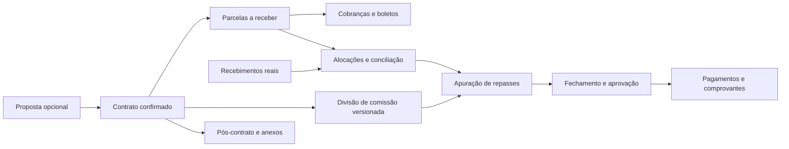

# Análise do sistema financeiro proposto no Trello

Data: 09/09/2026. Escopo: requisitos, arquitetura existente, dados atuais e proposta de implementação. Nenhum código do Precificador, registro no banco, planilha ou cartão foi alterado.

## 1. Parecer

O novo sistema é viável como módulo financeiro integrado ao Precificador. Já existem contratos, usuários, equipes, referências de imóveis, propostas e parte das regras de comissão. Entretanto, a estrutura atual ainda não sustenta, por si só, um controle confiável de contas a receber, liquidações, repasses e fechamento.

A prioridade deve ser definir a fonte oficial dos contratos e conciliar recebimentos. Criar telas e boletos antes dessas duas etapas permitiria automatizar cobranças e saldos sobre dados incompletos ou relacionados incorretamente.

Recomendo manter React + Flask + PostgreSQL e separar o domínio financeiro em serviços e tabelas próprios, com integração controlada ao domínio comercial existente. Não há evidência no levantamento de necessidade de um sistema independente ou de microserviços.

## 2. O que foi efetivamente verificado

- Os 17 cartões abertos do [quadro financas](https://trello.com/b/wGl35Brb/financas): 6 em Requisitos e 11 em Backlog. Sprint, Em andamento e Conclusão estavam vazias. Os resultados não apresentaram checklists ou comentários adicionais.
- Metadados, cabeçalhos e amostras das planilhas de contratos e recebimentos vinculadas pelo cartão Bases de dados. A inspeção das planilhas foi amostral; dimensões da grade não foram tratadas como quantidade de registros.
- Código local do Precificador, incluindo modelos, sincronização, divisão de comissão, dashboard de vendas, autenticação, rotas e documentação dos processos.
- PostgreSQL configurado no backend, por consultas SELECT e transação somente leitura, com limites de conexão e execução. As contagens abaixo são desta consulta, não dos números históricos dos documentos.
- Documentação pública oficial sobre integração Superlógica. Não houve autenticação no Superlógica nem validação de endpoints na conta da empresa. A documentação detalhada de Imobiliárias não carregou nesta consulta.

O banco consultado é o configurado no ambiente local do projeto. Não foi comprovado nesta análise que sua configuração é idêntica à implantação em produção. Também não foram inspecionados os códigos Apps Script ligados às planilhas ou executados fluxos pela interface em produção.

## 3. Requisitos e lacunas do levantamento

Os cartões definem a intenção do produto, mas ainda não constituem uma especificação executável: faltam responsáveis, regras de cálculo, estados, exceções e critérios de aceite. Os seis cartões da lista Requisitos não têm descrição.

| Cartões relacionados | Interpretação proposta | Definições necessárias / aceite mínimo |
|---|---|---|
| Lançar contrato; Lançar contratos | Cadastrar negócio formalizado e suas condições financeiras | Identificador único, partes, imóvel, datas, valores, responsável, origem e validação de parcelas. Definir se nasce de proposta aprovada e quando fica confirmado. |
| Editar venda | Corrigir contrato e condições | Separar edição de rascunho de aditivo após confirmação. Alteração deve guardar antes/depois, autor, motivo e efeito sobre parcelas, cobranças e repasses. |
| Anexar contrato | Vincular documento ao contrato | Tipos de arquivo, versão, permissão, autor e histórico; distinguir contrato assinado de minuta. |
| Lançar recebidos; Lançar recebeu | Registrar ingresso real e vinculá-lo às obrigações | Data, valor, conta, origem, comprovante, contrato/parcela; permitir parcial, adiantamento e estorno, sem duplicar baixas. |
| A receber; Relatorio de a Receber | Consultar obrigações e saldos | Separar vencido, a vencer, parcialmente recebido e quitado; filtros por vencimento, recebimento, contrato e responsável. Totais e exportação devem usar o mesmo filtro. |
| Previsão financeira | Projetar entradas e, se incluídas no escopo, saídas | Definir horizonte e se considera só contratos ou também propostas. Separar previsto contratual de expectativa comercial. |
| Gerar Boleto; Gerar Contrato - codigo boleto | Emitir cobrança vinculada a parcela | Confirmar quem paga, quem recebe, base do valor, vencimento, produto contratado e gatilho de emissão. Repetição da requisição não pode gerar segunda cobrança. |
| Nota fiscal | Controlar emissão e status fiscal | Definir emissor, tomador, serviço, valor, momento de emissão, cancelamento e fornecedor. O campo atual NF_61_ Imoveis é monetário, não comprovação de nota emitida. |
| Gerar trello pos contrato | Acompanhar etapas posteriores ao fechamento | O próprio cartão deixa a escolha entre Trello e controle interno em aberto. Definir etapas, responsáveis, prazos e sistema oficial do status. |
| Gerar BV | Requisito ainda ambíguo | O cartão diz apenas “Gerar BV dos valores”. Confirmar significado de BV, documento esperado, fórmula, beneficiários, aprovação e relação com pagamentos. Não assumir significado pela sigla. |
| Fechamento Pagamento | Consolidar obrigações de pagamento | Definir se cobre apenas comissões/premiações ou também fornecedores/despesas. Estabelecer corte, aprovação, retenções, pagamento parcial, reabertura e comprovantes. |
| Bases de dados | Identificar e migrar origens | Selecionar fonte oficial de recebimentos, reconciliar chaves e evitar duplicar histórico entre planilhas e banco. |
| Superlogica | Investigar integração | Validar produto/módulo da conta, permissões e operações disponíveis antes de fechar desenho de boleto e nota. |

Há sobreposição entre requisitos e backlog; isso deve virar uma relação de épico e entregas, e não funcionalidades duplicadas. Cadastro do contrato, emissão do boleto, recebimento e emissão de nota precisam de estados independentes.

## 4. Estrutura existente e reaproveitamento

O README descreve frontend React, backend Flask/Flask-RESTx, SQLAlchemy, PostgreSQL e aplicativo Expo/React Native compartilhando a API. O código examinado confirma o padrão de rotas, serviços e modelos.

### Contratos

`backend/app/models/contrato.py` define `contratos` como tabela larga que espelha a aba Vendas. Há compradores e vendedores em colunas numeradas até 15, cinco posições de parcelas, nomes de participantes, campos de comissão e links de anexos. Isso é útil para preservar e consultar o legado, mas limita a evolução operacional.

`backend/app/services/sync_contratos_service.py` declara explicitamente o fluxo Planilha → Banco e a planilha como fonte da verdade. O ID padrão coincide com o link do Trello. A rotina faz upsert por `id_contrato`, usa a última ocorrência de ID duplicado e não exclui contratos que desaparecem da origem. Campos presentes na origem podem atualizar valores existentes para nulo.

Consequência: um CRUD que grave diretamente nesses campos poderá ter suas alterações sobrescritas na próxima sincronização. O README documenta agendamento a cada 30 minutos; esse agendamento não foi verificado na VM.

### Vendas, pessoas e imóveis

O dashboard atual usa `Contrato` em `vendas_dash_service.py`; suas rotas oferecem consulta, resumo e detalhe. Não identifiquei nessas rotas o ciclo transacional financeiro solicitado.

No banco existem também `vendas`, `vendas_legado`, `pessoa_alias` e `vw_vendas`. A definição consultada de `vw_vendas` lê contratos e resolve nomes por `pessoa_alias`. Portanto, não se deve somar essas bases como negócios independentes. A view não representa toda a multiplicidade de compradores, vendedores e beneficiários.

Para pessoas internas, reaproveitar `usuarios.id_usuarios` e `equipes.id_equipe`; conservar no contrato a participação e equipe da época do negócio. Transferências atuais de equipe não devem recalcular repasses históricos.

O mapa de bases distingue `imovel_area` (catálogo próprio atual), `imoveis_legado` (dimensão comercial) e `imoveis` (mercado coletado). O cadastro contratual deve usar o imóvel próprio quando disponível e permitir identificação histórica pendente; não deve vincular um anúncio de mercado por conveniência.

### Comissão

A documentação de divisão de comissão contém dúvidas sobre destino e soma de percentuais. O código atual resolve parte delas: `RankingService.add_divisao_comissao` grava no PostgreSQL e exige 100% por papel informado, VENDA ou CAPTACAO.

Entretanto, o mesmo método calcula `comissao_valor` de cada linha sobre `Valor_Total_61`. Se os dois grupos forem enviados completos, os valores persistidos podem totalizar duas vezes essa base. Isso é uma inadequação potencial para repasse financeiro; não é prova de pagamento duplicado, e a tabela consultada está vazia. É necessário definir a base de cada grupo antes de reutilizar esse cálculo.

O método acrescenta linhas, sem substituir uma divisão anterior ou impedir a repetição do mesmo lançamento. Também pode seguir com valor zero quando não encontra o contrato no conjunto carregado. O seletor continua limitado a contratos de 2026. Essas regras precisam ser revistas para uso financeiro.

### Autorização

O guard frontend de Vendas restringe administrador/diretor. A rota de FormComissao aparece sem guard específico no App.js; as rotas examinadas de divisão e vendas não apresentam verificação de perfil. O middleware global aceita chave compartilhada da aplicação ou JWT.

Assim, a nova autorização financeira deve identificar usuário e permissão no servidor, em cada consulta, mutação, exportação e acesso a anexo. Uma chave de aplicação válida não identifica quem aprovou um pagamento. Trata-se de achado no código local, sem teste de exploração em produção.

## 5. Estado atual dos dados

### PostgreSQL — consulta em 09/09/2026

| Indicador | Resultado | Implicação |
|---|---:|---|
| Contratos totais | 1.604 | Histórico contratual reaproveitável |
| Origem legado_pre2024 | 895 | Datas entre 08/12/2015 e 27/12/2023 |
| Origem planilha | 709 | Datas entre 01/01/2024 e 06/09/2026 |
| Contratos sem Valor_Total_61 | 11 | 2 históricos e 9 da planilha; não converter ausência em receita zero sem regra |
| Contratos sem código de imóvel | 1.435 | 895 históricos e 540 da planilha; migração não pode exigir vínculo retroativo imediato |
| Contratos da planilha com alguma data de parcela | 698 | Existência de data não comprova cronograma completo |
| Contratos da planilha com algum valor de parcela | 129 | Cobertura insuficiente para gerar a receber completo automaticamente |
| Históricos com data ou valor de parcela | 0 | Não presumir que sejam todos quitados nem reconstruir parcelas arbitrariamente |
| Contratos da planilha com campo de anexo preenchido | 541 | São referências; arquivos e permissões não foram verificados |
| Recebimentos legados | 172 | Precisam de saneamento e conciliação |
| Recebimentos sem referência de contrato | 47 | Não podem baixar contrato automaticamente |
| Recebimentos sem data | 14 | Não permitem atribuição segura ao mês de caixa |
| Recebimentos sem valor preenchido | 7 | Precisam de revisão |
| Recebimentos com referência preenchida | 125 | Nenhum correspondeu exatamente a contratos.id_contrato após trim |
| Divisões de comissão | 0 | Funcionalidade de cadastro existe, sem registros nesta base |

As contagens de ausência podem se sobrepor. “Algum valor de parcela” inclui qualquer campo não nulo, inclusive zero, e não significa que todas as parcelas estejam preenchidas.

`recebidos_legado.valor_recebido` é TEXT, enquanto o campo de contrato também é texto livre. Não encontrei chaves estrangeiras em `contratos`, `divisao_comissao` e `recebidos_legado` na consulta de constraints. A igualdade sem correspondência não prova que os recebimentos sejam inválidos: prova que o vínculo atual não funciona por essa chave simples.

Não foram identificadas no inventário do schema public entidades financeiras dedicadas a parcelas normalizadas, alocações de recebimentos, cobranças externas, notas fiscais, repasses e lotes de pagamento. A conclusão limita-se ao schema e ao código examinados.

### Planilhas do Trello

[Controle de Contratos](https://docs.google.com/spreadsheets/d/1GLYIVuOG0heAXKxL5MdtjNxlR7o9N8BaWuvwHF9Jb0Y/edit) contém Vendas, Controle, Financeiro, Recebido, Divisao_Comissao e abas de premiação. O gid do Trello abre Controle, mas o backend lê Vendas.

- Vendas confirma o formato amplo espelhado no modelo.
- Financeiro contém Id_Contrato, Valor_Total_61, NF_61_ Imoveis, Data_Parcela, Valor_Parcela, Recebido, Data_Recebimento e Saldo_Final. O filtro exibido era 2025; Controle estava em 2026.
- Uma linha amostrada de Financeiro contém recebimento superior ao valor da parcela e saldo negativo. Pode representar adiantamento, agregação por contrato ou conciliação incorreta; a amostra não permite decidir. O novo modelo deve distinguir essas situações.
- Recebido usa Data, Contrato e Valor Recebido; as referências amostradas têm formato semelhante a datas, diferente dos IDs C... de Vendas. Datas exibidas sem ano também exigem cuidado ao importar.
- O intervalo A1:H3 de Divisao_Comissao estava vazio; isso não equivale a auditoria completa da aba.

[Planilha apontada como recebíveis](https://docs.google.com/spreadsheets/d/151HXN4U-iFi3LnlxB7UefJ_RP6sX9Aw3ygbYFVX2DbY/edit) está intitulada ValoresRecebidos_Contratos61_Obsoleto. Tem a aba Recebidos com três colunas. Na amostra, o primeiro cabeçalho é um nome de pessoa embora as linhas abaixo contenham datas; há lançamento sem Num_Contrato e outros com IDs C....

É necessário decidir qual fonte é oficial hoje. O nome “Obsoleto” não autoriza descartar os dados; também não justifica tratá-los como operação atual. Não foi comprovado que essa planilha e recebidos_legado contenham o mesmo conjunto.

## 6. Modelo funcional e de dados recomendado

Fluxo proposto:

O gatilho de repasse após recebimento é uma proposta a validar, não uma regra confirmada. Nota fiscal também deve ter gatilho próprio definido pelo processo fiscal.

| Entidade proposta | Responsabilidade |
|---|---|
| Contrato e versões | Identificador, origem, situação, condições, valores aprovados, vigência e histórico |
| Partes do contrato | Compradores, vendedores e pagadores, em relações N:N; documento e contato separados |
| Participações de comissão | Beneficiário, papel, base de cálculo, percentual, valor, equipe histórica e versão |
| Parcelas a receber | Obrigação, pagador, vencimento, valor e ajustes; quantidade livre |
| Recebimentos | Movimento real: data, valor, conta, origem e comprovante |
| Alocações | Relacionar recebimentos e parcelas; suporta várias baixas por parcela e um recebimento para várias parcelas |
| Cobranças | Provedor, ID externo, contrato/parcela, valor, status, linha digitável e vencimento |
| Notas fiscais | ID externo, número, emissor, tomador, valor, status e arquivos; referência ao evento faturado |
| Obrigações de repasse | Beneficiário, origem do direito, parcela elegível, valor e situação |
| Fechamentos e pagamentos | Período, itens congelados, aprovador, execução e comprovantes |
| Anexos e histórico | Versões, permissões, autor, evento e motivo |
| Integrações e eventos | Requisições, identificadores únicos, tentativas, erros, eventos recebidos e processamento |
| Mapeamento de migração | Origem/aba/linha/chave antiga, chave nova, evidência e situação de conciliação |

Valores devem usar decimal e NUMERIC, com regra explícita de arredondamento; percentuais precisam de escala uniforme. Não misturar 0,05, 5 e “5%” sem conversão consciente.

Não confundir valor do imóvel, comissão total, parcela da comissão da 61, valor de nota e líquido após repasses. A soma das parcelas deve fechar a obrigação definida para aquele pagador, não necessariamente Valor_Negocio ou Valor_Total_61.

Saldo de uma parcela deve derivar da obrigação ajustada menos as alocações válidas. Valor recebido sem alocação permanece como crédito/pendência e não vira saldo negativo silencioso. Correções financeiras devem produzir reversão ou ajuste auditável.

## 7. Organização das telas e API

Proponho um menu Financeiro com Contratos, A receber, Recebimentos e conciliação, Repasses e pagamentos, Documentos fiscais, Previsão e Integrações. BV só deve ganhar fluxo próprio depois de definido.

O detalhe do contrato concentraria partes/imóvel, condições financeiras, parcelas/cobranças, recebimentos, comissões/repasses, anexos, pós-contrato e histórico. O usuário deve conseguir navegar de um saldo até os lançamentos que o compõem.

No backend, separar serviços de contratos, contas a receber, conciliação, comissões, fechamento e integração. Reutilizar o padrão do Precificador, com transações locais, validações de domínio, controle de versão contra edição simultânea e permissões por operação. Os caminhos exatos da API são uma decisão de implementação posterior.

Indicadores devem distinguir previsto no período, recebido no período, vencido em uma data de corte, crédito não alocado e pagamento efetivado. Uma venda assinada não equivale a entrada de caixa.

## 8. Integração Superlógica

O [cartão Superlogica](https://trello.com/c/EY5drTNq) aponta para API Condomínios. A documentação oficial de Imobiliárias aponta para uma documentação própria e informa uso de app_token/access_token vinculados às permissões de usuário. Antes de escolher endpoints, confirmar qual produto e módulo a 61 utiliza. [Fonte oficial](https://imobiliarias.superlogica.com/hc/pt-br/articles/12249428568855-Utiliza%C3%A7%C3%A3o-de-APIs-para-integra%C3%A7%C3%B5es-no-sistema-Superl%C3%B3gica).

Desenho recomendado: o Precificador registra a intenção de cobrança e uma tarefa de integração na mesma transação; um processador envia ao provedor e guarda o resultado. Se houver timeout após emissão externa, consultar o identificador antes de repetir. Cancelamento, substituição e confirmação de recebimento devem ter estados próprios.

Se o produto contratado oferecer webhooks, processar eventos com autenticação e deduplicação, mantendo consulta periódica para conciliação. A documentação pública descreve reentregas de webhooks, reforçando a necessidade de não baixar duas vezes; a disponibilidade desse mecanismo na conta ainda deve ser validada. [Fonte oficial](https://superlogica.com/recursos/webhooks-no-superlogica/).

Não é possível afirmar ainda que a API indicada cobre todos os casos de comissão de venda, boleto e nota necessários. Nenhuma emissão, cancelamento ou pagamento foi realizado.

## 9. Migração e sequência de implementação

1. **Fechar decisões de negócio.** Fonte oficial de recebimentos, significado de BV, bases de cálculo, pagadores/beneficiários, regra de repasse, perfis e produto Superlógica.
2. **Preparar dados.** Fotografar as fontes na data de corte, manter rastreabilidade, normalizar valores/datas e produzir fila de pendências. Contratos históricos sem parcelas devem permanecer identificados como histórico incompleto, sem saldo inventado.
3. **Conciliar recebimentos.** Criar correspondência explícita entre chaves antigas e contratos; revisar casos ambíguos. Não casar automaticamente só por nome, endereço ou valor. Impedir dupla importação por origem e identificador do registro, com análise de duplicatas entre fontes.
4. **Definir transição da fonte da verdade.** Recomendo passar a autoria de contratos ao sistema por lote ou data de corte. Para registros já migrados, a sincronização antiga deve deixar de sobrescrever os campos administrados no módulo. Até isso estar pronto, manter novas estruturas isoladas da rotina antiga.
5. **Entregar núcleo.** Contratos, partes, versões, anexos, parcelas, recebimentos manuais, alocações e relatório a receber. Deve ser útil mesmo antes das integrações externas.
6. **Entregar repasses.** Regras versionadas, apuração, aprovação e fechamento. Tratar BV nessa etapa apenas se sua definição confirmar relação com o fluxo.
7. **Integrar cobranças e fiscal.** Homologar emissão, reconsulta, cancelamento, duplicidade de evento, falha e recuperação no produto correto.
8. **Pós-contrato e previsão.** Consolidar tarefas internas/Trello, alertas e previsão baseada nos dados conciliados.
9. **Operar em paralelo e reconciliar.** Comparar contratos, parcelas, recebimentos alocados/não alocados e pagamentos por período; explicar diferenças antes da troca definitiva. Preservar rankings e metas que consomem contratos.

Não recomendo estimativa fechada de prazo com o levantamento atual: a conciliação e a integração ainda podem alterar substancialmente o esforço.

## 10. Critérios de aceite prioritários

- Reenvio de cadastro/integração não cria contrato, boleto, baixa ou pagamento duplicado.
- Um recebimento parcial mantém saldo correto; vários recebimentos podem quitar a mesma parcela.
- Um recebimento superior à obrigação gera crédito/pendência explícita, conforme regra definida.
- Estorno restaura a posição de forma rastreável e não apaga evidência.
- Alteração de contrato confirmado não muda silenciosamente valores já cobrados ou pagos.
- Fechamento aprovado preserva seus itens; reabertura exige permissão e motivo.
- Mudança atual de equipe não altera beneficiários históricos.
- A soma de rateios fecha exatamente a base aprovada após arredondamentos.
- Exportações, anexos, telas e API respeitam os mesmos limites de acesso.
- Relatórios reconciliam seus totais com os lançamentos filtrados e deixam pendências fora de “quitado”.
- Migração pode ser reexecutada sem duplicar dados e explica registros rejeitados.
- Rankings e metas mantêm resultados esperados após a transição.

Esses são critérios propostos para a implementação futura; não são testes executados nesta análise.

## 11. Decisões que precisam ser respondidas

1. Qual é a fonte oficial de recebimentos hoje: Recebido, Recebidos/Obsoleto, Superlógica ou outra?
2. O sistema substituirá a planilha de contratos ou deverá mantê-la como fonte de edição?
3. O que significa BV e qual exemplo representa o resultado esperado?
4. Quem paga a comissão e qual valor constitui a obrigação cobrada pela 61?
5. Repasse nasce na assinatura, no recebimento proporcional ou em outro marco?
6. Fechamento inclui apenas comissões/premiações ou todo o contas a pagar?
7. Quem pode cadastrar, corrigir, emitir, estornar, aprovar e efetivar pagamento?
8. Qual produto/módulo Superlógica está contratado e quais operações estão habilitadas?
9. Qual é o evento de emissão de nota, e quem define os dados fiscais?
10. Pós-contrato ficará no Trello ou no módulo interno? Quais etapas e responsáveis?

Essas pendências não impedem o desenho técnico, mas impedem tratar o levantamento como pronto para desenvolvimento integral.

## 12. Referências técnicas locais consultadas

Raiz: C:\Users\Best Option Notebook\Desktop\61E\Precificador.

- README.md; MAPA_BANCO.md.
- docs/processos/3.15 - Mapa das Bases Atuais.md.
- docs/processos/Documentacao_Controle_de_Contratos_61_Imoveis.md.
- docs/processos/1.6 - Divisão de Comissão.md.
- backend/app/models/contrato.py; backend/app/models/legado_diversos.py.
- backend/app/services/sync_contratos_service.py; ranking_service.py; vendas_dash_service.py; db_loaders.py.
- backend/app/routes/divisao_comissao_routes.py; vendas_routes.py.
- backend/app/utils/auth_middleware.py; frontend/src/App.js; frontend/src/auth/VendasRoute.js.

Documentos antigos possuem contagens e dúvidas superadas pelo código e pela consulta atual. Nesta análise, foi dada precedência à evidência atual, preservando como pendente aquilo que ela não resolve.
