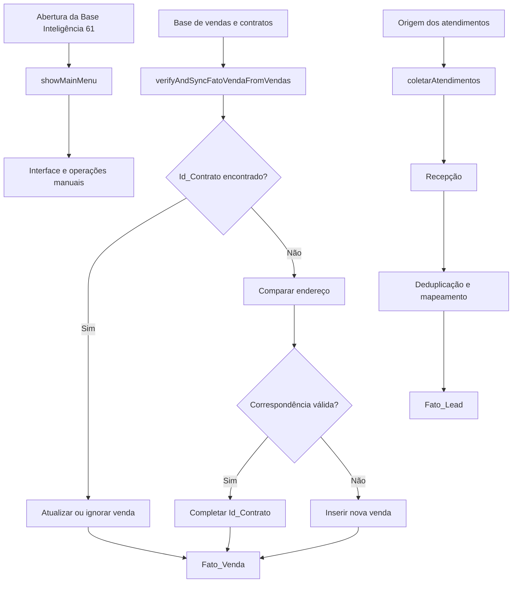

# Documentação dos Acionadores e Processos — Base Inteligência 61

**Organização:** 61 Imóveis  
**Base de referência:** `Base Inteligência 61`  
**Projeto principal do Apps Script:** `Gestão de dados`  
**Data de referência do painel:** 13/07/2026  
**Funções principais da base:** `showMainMenu` e `verifyAndSyncFatoVendaFromVendas`

---

## 1. Identificação e escopo

Este documento corresponde especificamente à base **Base Inteligência 61**.

O painel **Meus acionadores** do Google Apps Script pode exibir acionadores de várias planilhas e projetos da mesma conta. Por isso, nem todas as linhas visíveis no painel pertencem ao código da Base Inteligência 61.

Nesta documentação, os itens foram separados em três grupos:

1. **Acionadores principais da Base Inteligência 61**;
2. **Acionadores da cópia ou de processos diretamente relacionados à base**;
3. **Outros acionadores visíveis no painel**, mantidos apenas como inventário de dependências externas.

> A presença de uma função no painel não significa que ela esteja armazenada no mesmo projeto Apps Script da Base Inteligência 61.

---

## 2. Objetivo da base

A Base Inteligência 61 funciona como estrutura central de consolidação e organização de dados operacionais da imobiliária, incluindo informações relacionadas a:

- vendas;
- contratos;
- leads;
- atendimentos;
- corretores;
- gerentes;
- clientes;
- imóveis;
- indicadores gerenciais.

Os acionadores principais automatizam a abertura da interface da base e a sincronização da tabela de vendas.

---

## 3. Resumo dos acionadores da Base Inteligência 61

| Classificação | Arquivo / base | Projeto Apps Script | Função | Evento | Última execução | Taxa de erros |
|---|---|---|---|---|---|---:|
| Principal | Base Inteligência 61 | Gestão de dados | `showMainMenu` | Da planilha — Ao abrir | 13/07/2026 13:43:27 | 0% |
| Principal | Base Inteligência 61 | Gestão de dados | `verifyAndSyncFatoVendaFromVendas` | De acordo com o horário | 13/07/2026 12:40:22 | 35,71% |
| Relacionado | Cópia de Base Inteligência 61 | Gestão de dados | `coletarAtendimentos` | De acordo com o horário | 12/07/2026 17:50:09 | 0% |
| Relacionado | Cópia de Base Inteligência 61 | Gestão de dados | `transferirDadosDaRecepcaoParaFatoLead` | De acordo com o horário | 12/07/2026 18:49:30 | 0% |
| Relacionado | Cópia de Base Inteligência 61 | Gestão de dados | `setMenuContent` | Da planilha — Ao abrir | Sem execução registrada | — |

---

# 4. Processo principal: abertura da Base Inteligência 61

## 4.1. Acionador `showMainMenu`

**Base:** Base Inteligência 61  
**Projeto:** Gestão de dados  
**Evento:** da planilha — ao abrir  
**Situação observada:** operacional, com 0% de erros

### Finalidade

Inicializar a interface de trabalho da Base Inteligência 61 quando o usuário abre a planilha.

### Fluxo

1. O usuário abre a planilha `Base Inteligência 61`.
2. O Google Sheets dispara o acionador.
3. A função `showMainMenu` é executada.
4. O script monta ou apresenta o menu/interface principal.
5. O usuário passa a ter acesso às rotinas operacionais disponibilizadas pelo projeto.

### Entradas

- abertura da planilha;
- arquivos HTML, menus ou componentes utilizados pela interface;
- permissões do usuário.

### Saídas

- menu personalizado;
- barra lateral;
- janela modal;
- acesso às funções operacionais da base.

### Controles necessários

- confirmar a existência dos arquivos HTML chamados pela função;
- confirmar que os nomes das funções vinculadas ao menu continuam válidos;
- evitar rotinas demoradas dentro do acionador de abertura;
- tratar falhas sem impedir a abertura normal da planilha;
- não executar sincronizações pesadas automaticamente no `showMainMenu`.

### Riscos

- arquivo HTML renomeado ou excluído;
- função vinculada ao menu inexistente;
- falta de autorização;
- duplicidade de menu;
- conflito com outro `onOpen`;
- interface carregada mais de uma vez.

---

# 5. Processo principal: sincronização da Fato_Venda

## 5.1. Acionador `verifyAndSyncFatoVendaFromVendas`

**Base:** Base Inteligência 61  
**Projeto:** Gestão de dados  
**Evento:** de acordo com o horário  
**Taxa de erros observada:** **35,71%**  
**Situação:** instável e com necessidade de correção

### Finalidade

Verificar os registros existentes na origem de vendas e sincronizá-los com a tabela `Fato_Venda` da Base Inteligência 61.

### Fluxo funcional esperado

1. Abrir a planilha ou aba de origem das vendas.
2. Ler os registros disponíveis.
3. Identificar a estrutura do cabeçalho.
4. Padronizar os dados de cada venda.
5. Localizar uma venda correspondente na `Fato_Venda`.
6. Utilizar o `Id_Contrato` como identificador principal.
7. Quando o `Id_Contrato` estiver ausente ou ainda não tiver sido preenchido no destino, utilizar o endereço como referência auxiliar.
8. Decidir entre:
   - atualizar uma venda existente;
   - completar um identificador ausente;
   - inserir uma nova venda;
   - ignorar um registro já sincronizado;
   - rejeitar uma linha inválida.
9. Gravar os dados na `Fato_Venda`.
10. Registrar o resumo da execução.

### Chave principal

```text
Id_Contrato
```

### Chave auxiliar

```text
Endereço do imóvel
```

> O endereço deve ser usado somente como contingência. Ele não é uma chave tão segura quanto o `Id_Contrato`, pois pode conter abreviações, diferenças de grafia ou descrições semelhantes.

### Regras de negócio

- uma venda não pode ser inserida duas vezes;
- o `Id_Contrato` deve prevalecer sobre o endereço;
- uma linha existente sem `Id_Contrato` pode receber o identificador posteriormente;
- o endereço deve ser normalizado antes da comparação;
- campos vazios da origem não devem apagar dados válidos do destino sem uma regra expressa;
- datas precisam ser gravadas como data;
- valores devem ser numéricos;
- vendedores, captadores, gerentes e corretores devem seguir o padrão de identificação da Base Inteligência 61;
- o processo deve ser idempotente: executar novamente não pode duplicar a mesma venda.

### Entradas esperadas

- tabela de vendas;
- registros de contratos;
- `Id_Contrato`;
- data da venda;
- valor do negócio;
- vendedores;
- captadores;
- bairro;
- endereço;
- código do imóvel;
- demais campos comerciais.

### Saída principal

```text
Base Inteligência 61 → Fato_Venda
```

### Resultados possíveis por linha

| Resultado | Significado |
|---|---|
| Inserido | A venda ainda não existia e foi adicionada. |
| Atualizado | A venda existia e recebeu dados novos ou corrigidos. |
| Identificador completado | A linha existia por endereço e recebeu o `Id_Contrato`. |
| Ignorado | O registro já estava sincronizado e não exigia alteração. |
| Rejeitado | A linha estava incompleta ou inválida. |
| Erro | O script não conseguiu processar ou gravar a linha. |

### Possíveis causas da taxa de erros

- `Id_Contrato` vazio;
- endereço diferente entre origem e destino;
- alteração de cabeçalhos;
- quantidade de colunas incompatível;
- data inválida;
- valor monetário armazenado como texto;
- linha sem identificador mínimo;
- duplicidade já existente na `Fato_Venda`;
- dimensão de corretor ou gerente não encontrada;
- planilha de origem sem permissão;
- timeout;
- gravação concorrente;
- fórmula ou intervalo protegido no destino.

### Ações prioritárias

1. Abrir a página **Execuções** do projeto `Gestão de dados`.
2. Selecionar uma execução com falha.
3. Registrar:
   - mensagem de erro;
   - função;
   - arquivo;
   - número da linha;
   - contrato;
   - endereço;
   - horário.
4. Identificar se as falhas ocorrem sempre no mesmo registro.
5. Validar os cabeçalhos da origem e da `Fato_Venda`.
6. Testar manualmente com uma pequena quantidade de linhas.
7. Confirmar se o processo está inserindo dados parcialmente antes de falhar.
8. Implementar controle de concorrência com `LockService`.
9. Criar uma aba de auditoria.

---

# 6. Processo relacionado: coleta de atendimentos

## 6.1. Acionador `coletarAtendimentos`

**Base:** Cópia de Base Inteligência 61  
**Relação com a Base Inteligência 61:** processo alimentador  
**Evento:** de acordo com o horário  
**Taxa de erros observada:** 0%

### Finalidade

Coletar atendimentos oriundos de uma fonte operacional e preparar os registros para posterior transferência à tabela `Fato_Lead`.

### Fluxo esperado

1. Acessar a fonte dos atendimentos.
2. Definir o período de coleta.
3. Ler os registros novos.
4. Padronizar os dados.
5. Validar campos obrigatórios.
6. Gravar os registros em uma área de recepção.
7. Disponibilizar os dados para a etapa de transferência.

### Dados possivelmente tratados

- data do atendimento;
- cliente;
- telefone;
- imóvel;
- código do imóvel;
- portal;
- origem;
- corretor;
- gerente;
- equipe;
- observação;
- situação do atendimento.

### Pendente de confirmação no código

- fonte exata;
- nome da aba;
- período;
- paginação;
- uso de API;
- regra de registros novos;
- tratamento de reprocessamento.

---

# 7. Processo relacionado: transferência para Fato_Lead

## 7.1. Acionador `transferirDadosDaRecepcaoParaFatoLead`

**Base:** Cópia de Base Inteligência 61  
**Relação com a Base Inteligência 61:** grava dados na estrutura analítica de leads  
**Evento:** de acordo com o horário  
**Taxa de erros observada:** 0%

### Finalidade

Transformar, deduplicar e transferir os registros da recepção para a tabela `Fato_Lead`.

### Fluxo

1. Ler a base de recepção.
2. Ignorar o cabeçalho.
3. Padronizar os campos.
4. Criar uma chave composta para identificar duplicidades.
5. Separar os registros únicos dos repetidos.
6. Gravar duplicados em uma área específica.
7. Mapear corretor e gerente.
8. Converter nomes para IDs, quando necessário.
9. abrir a base de destino;
10. inserir os registros válidos na `Fato_Lead`;
11. registrar o resumo da execução.

### Chave de deduplicação conhecida

```text
cliente | telefone | código do imóvel | portal
```

### Regras

- manter apenas o primeiro registro de cada chave;
- separar os repetidos;
- padronizar telefone;
- padronizar data;
- mapear corretor;
- mapear gerente;
- não apagar a recepção antes da confirmação da gravação;
- impedir nova carga dos mesmos registros;
- registrar as quantidades processadas.

### Saídas

- registros únicos na `Fato_Lead`;
- registros repetidos em uma aba de duplicados;
- logs de processamento.

---

# 8. Processo relacionado: conteúdo do menu

## 8.1. Acionador `setMenuContent`

**Base:** Cópia de Base Inteligência 61  
**Evento:** da planilha — ao abrir  
**Última execução:** sem histórico registrado

### Finalidade

Montar ou atualizar os itens de menu da cópia da Base Inteligência 61.

### Verificações

- confirmar se o acionador foi autorizado;
- confirmar se a função ainda existe;
- verificar se outro `onOpen` já cria o mesmo menu;
- verificar se o usuário abriu a planilha após a criação do acionador;
- confirmar que não há duplicidade com `showMainMenu`.

---

# 9. Fluxo consolidado da Base Inteligência 61



---

# 10. Dependências de dados

## 10.1. Dependências da Fato_Venda

- base operacional de vendas;
- controle de contratos;
- cadastro de corretores;
- cadastro de gerentes;
- cadastro de imóveis;
- calendário;
- padronização de bairros;
- identificação de vendedores e captadores.

## 10.2. Dependências da Fato_Lead

- fonte de atendimentos;
- área de recepção;
- dimensão de corretor;
- dimensão de gerente;
- dados do imóvel;
- dados do cliente;
- origem ou portal do lead.

## 10.3. Dependência externa importante

O processo `transferData`, pertencente à base **Controle de Contratos 61 Imóveis**, pode fornecer ou organizar dados que posteriormente são consumidos pela sincronização da `Fato_Venda`.

Essa função não pertence ao projeto principal da Base Inteligência 61 e deve ser documentada separadamente.

---

# 11. Matriz de riscos

| Processo | Risco | Impacto | Prioridade |
|---|---|---|---|
| `verifyAndSyncFatoVendaFromVendas` | Venda duplicada | Indicadores incorretos | Alta |
| `verifyAndSyncFatoVendaFromVendas` | Venda não inserida | Relatório incompleto | Alta |
| `verifyAndSyncFatoVendaFromVendas` | Endereço divergente | Falha de correspondência | Alta |
| `verifyAndSyncFatoVendaFromVendas` | Execuções simultâneas | Duplicidade e conflito | Alta |
| `transferirDadosDaRecepcaoParaFatoLead` | Lead duplicado | Contagem incorreta | Média |
| `transferirDadosDaRecepcaoParaFatoLead` | Corretor sem correspondência | Lead sem responsável | Média |
| `coletarAtendimentos` | Falha na fonte | Interrupção da carga | Média |
| `showMainMenu` | Erro de interface | Usuário sem acesso ao menu | Baixa |

---

# 12. Procedimento operacional de monitoramento

## Diário

1. Consultar a execução de `verifyAndSyncFatoVendaFromVendas`.
2. Conferir se a taxa de erros aumentou.
3. Verificar a quantidade de vendas inseridas e atualizadas.
4. Conferir registros rejeitados.
5. Validar se houve duplicidade.
6. Verificar a execução de `coletarAtendimentos`.
7. Verificar a execução de `transferirDadosDaRecepcaoParaFatoLead`.

## Semanal

1. Comparar a origem de vendas com a `Fato_Venda`.
2. Conferir contratos sem `Id_Contrato`.
3. Conferir endereços sem correspondência.
4. Conferir leads sem corretor ou gerente.
5. Revisar duplicados.
6. Revisar permissões.
7. Revisar os acionadores sem histórico.

---

# 13. Padrão recomendado de logs

```javascript
console.log("INÍCIO | função=verifyAndSyncFatoVendaFromVendas");
console.log("ORIGEM | registros=" + totalOrigem);
console.log("INSERIDOS | quantidade=" + inseridos);
console.log("ATUALIZADOS | quantidade=" + atualizados);
console.log("IGNORADOS | quantidade=" + ignorados);
console.log("REJEITADOS | quantidade=" + rejeitados);
console.log("ERROS | quantidade=" + erros);
console.log("FIM | duração_ms=" + duracao);
```

Para erro por linha:

```javascript
console.error(
  "ERRO_VENDA" +
  " | linha=" + numeroLinha +
  " | idContrato=" + idContrato +
  " | endereco=" + endereco +
  " | mensagem=" + error.message
);
```

---

# 14. Controle de concorrência recomendado

```javascript
function verifyAndSyncFatoVendaFromVendas() {
  const lock = LockService.getScriptLock();

  if (!lock.tryLock(30000)) {
    throw new Error("A sincronização da Fato_Venda já está em execução.");
  }

  try {
    // Processo de leitura, validação e sincronização.
  } finally {
    lock.releaseLock();
  }
}
```

---

# 15. Inventário dos outros acionadores visíveis no painel

Os acionadores abaixo aparecem no mesmo painel da conta, mas **não pertencem ao projeto principal da Base Inteligência 61**.

| Base / arquivo | Projeto | Função | Relação com esta documentação |
|---|---|---|---|
| Solicitações - 61 (Respostas) | Solicitações 61 | `mainWork` | Processo externo |
| CONTROLE DE QUALIDADE - 2023 | Projeto sem título | `finalizarImoveis` | Processo externo |
| CONTROLE DE QUALIDADE - 2023 | Projeto sem título | `verificarDocumentacoesEEnviarEmail` | Processo externo |
| CONTROLE DE QUALIDADE - 2024 | Verificar Documentações | `verificarDocumentacoes` | Processo externo |
| CONTROLE DE QUALIDADE - 2024 | Verificar Documentações | `verificarDocumentacoesEEnviarEmail` | Processo externo |
| Cópia de CONTROLE DE LEADS COMPRA E VENDA | PreencherBase | `transferirDados` | Processo externo |
| Controle de Contratos 61 Imóveis 2024 OFICIAL | Projeto sem título | `transferData` | Fonte ou dependência externa |
| ValoresRecebidos_Contratos61_Obsoleto | Lancamento_Contratos | `showForm` | Processo externo |
| Teste_Respostas acelera | ETL_Form_Acelera_Teste | `executarTodasAsExtracoes` | Processo externo |
| CONTROLE DE LEADS COMPRA E VENDA | PreencherBase | `importarLeadsParaPlanilha` | Processo externo |
| CONTROLE DE LEADS COMPRA E VENDA | PreencherBase | `enviarEmailLeads` | Processo externo |
| CONTROLE DE LEADS COMPRA E VENDA | PreencherBase | `showMainMenu` | Processo externo |
| Cópia de CONTROLE DE LEADS COMPRA E VENDA | PreencherBase | `onOpen` | Processo externo |

---

# 16. Pendências para completar a documentação técnica

Para confirmar integralmente o funcionamento da Base Inteligência 61, ainda devem ser anexados ou revisados os códigos atuais de:

- `showMainMenu`;
- `verifyAndSyncFatoVendaFromVendas`;
- `coletarAtendimentos`;
- `transferirDadosDaRecepcaoParaFatoLead`;
- `setMenuContent`.

Também devem ser confirmados:

- IDs das planilhas;
- nomes exatos das abas;
- cabeçalhos;
- chave definitiva de atualização;
- regra de atualização de campos;
- tratamento de cancelamentos;
- tratamento de linhas incompletas;
- política de reprocessamento;
- logs atuais;
- horários exatos dos acionadores.

---

# 17. Resumo executivo

Este documento corresponde à **Base Inteligência 61**.

As funções principais dessa base são:

- `showMainMenu`, responsável pela interface de abertura;
- `verifyAndSyncFatoVendaFromVendas`, responsável pela sincronização da `Fato_Venda`.

As funções `coletarAtendimentos`, `transferirDadosDaRecepcaoParaFatoLead` e `setMenuContent` pertencem à **Cópia de Base Inteligência 61**, mas integram o mesmo ecossistema de dados.

O principal ponto de atenção é a taxa de erros de **35,71%** na sincronização da `Fato_Venda`. Os demais acionadores diretamente relacionados apresentam 0% de erros ou ainda não possuem histórico registrado.
