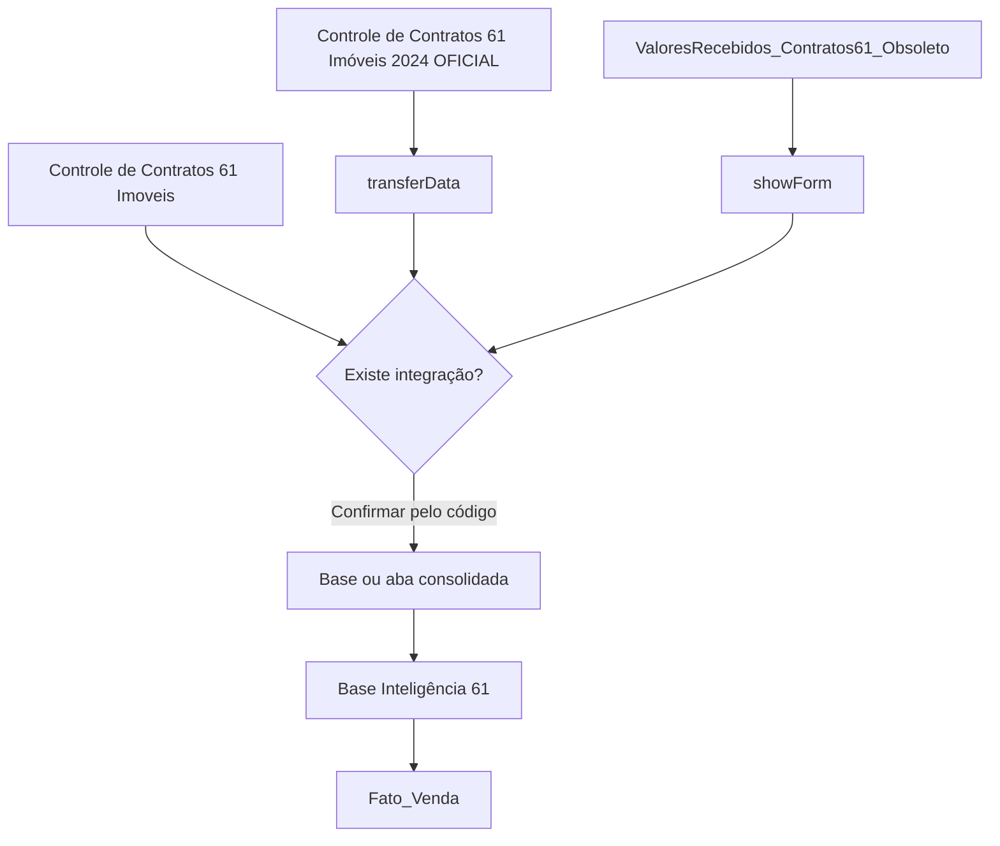

# Documentação dos Acionadores e Processos — Controle de Contratos 61 Imoveis

**Organização:** 61 Imóveis  
**Base de referência:** `Controle de Contratos 61 Imoveis`  
**Data de referência do painel:** 14/07/2026  
**Escopo:** processos e acionadores relacionados ao ecossistema contratual da base de referência.

---

## 1. Distinção entre as bases

A base de referência desta documentação é:

```text
Controle de Contratos 61 Imoveis
```

Ela é diferente da base:

```text
Controle de Contratos 61 Imóveis 2024 OFICIAL
```

Os dois nomes representam bases distintas e não devem ser tratados como variações do mesmo arquivo.

### Regra adotada nesta documentação

- `Controle de Contratos 61 Imoveis` é a **base de referência**;
- `Controle de Contratos 61 Imóveis 2024 OFICIAL` é uma **base relacionada**, que possui o acionador `transferData`;
- `ValoresRecebidos_Contratos61_Obsoleto` é outra **base relacionada**, que possui o acionador `showForm`;
- `Base Inteligência 61` é uma **integração externa**, que possui a função `verifyAndSyncFatoVendaFromVendas`.

> A relação entre essas bases precisa ser confirmada pelo código-fonte e pelos IDs de planilha. O painel de acionadores, sozinho, mostra o projeto, a função e a execução, mas não explica todo o fluxo de dados.

---

## 2. Objetivo desta documentação

Registrar os processos automatizados que podem produzir, transferir, consultar ou consumir dados relacionados ao Controle de Contratos 61 Imoveis.

O documento organiza:

- a base de referência;
- as bases relacionadas;
- as funções identificadas;
- os eventos de execução;
- as taxas de erro;
- as possíveis entradas e saídas;
- as dependências;
- os riscos;
- as pendências de validação.

---

## 3. Inventário dos processos relacionados

| Classificação | Base / arquivo | Projeto Apps Script | Função | Evento | Última execução | Taxa de erros |
|---|---|---|---|---|---|---:|
| Base de referência | Controle de Contratos 61 Imoveis | Não identificado no material fornecido | Não identificada diretamente | Não identificado | Não identificado | Não identificado |
| Base relacionada | Controle de Contratos 61 Imóveis 2024 OFICIAL | Projeto sem título | `transferData` | De acordo com o horário | 14/07/2026 12:50:02 | 11,11% |
| Base relacionada | ValoresRecebidos_Contratos61_Obsoleto | Lancamento_Contratos | `showForm` | Da planilha — Ao abrir | 14/07/2026 09:16:21 | 0% |
| Integração externa | Base Inteligência 61 | Gestão de dados | `verifyAndSyncFatoVendaFromVendas` | De acordo com o horário | 14/07/2026 12:40:22 | 35,71% |

### Observação importante

No inventário fornecido, não aparece uma linha cujo nome do arquivo seja exatamente `Controle de Contratos 61 Imoveis`.

Portanto, não é correto afirmar que `transferData` pertence diretamente à base de referência. O acionador foi associado à base distinta `Controle de Contratos 61 Imóveis 2024 OFICIAL`.

---

# 4. Base de referência: Controle de Contratos 61 Imoveis

## 4.1. Finalidade geral

A base de referência deve centralizar ou apoiar o controle das informações contratuais da 61 Imóveis.

Entre os dados que normalmente compõem esse tipo de estrutura estão:

- identificação do contrato;
- data;
- partes do negócio;
- imóvel;
- vendedores;
- captadores;
- gerente;
- valores;
- comissão;
- recebimentos;
- documentação;
- anexos;
- etapas de assinatura, escritura, quitação e posse.

## 4.2. Situação dos acionadores

Com o material disponibilizado, não foi possível identificar qual acionador está instalado diretamente na base `Controle de Contratos 61 Imoveis`.

Para completar a documentação específica desta base, é necessário fornecer:

- o código Apps Script vinculado diretamente a ela;
- uma captura do editor do projeto;
- o nome do projeto;
- os acionadores desse projeto;
- os IDs ou nomes das planilhas acessadas pelo código.

## 4.3. O que não deve ser presumido

Não se deve presumir que:

- `transferData` está dentro da base de referência;
- a base `2024 OFICIAL` substitui a base de referência;
- as duas bases possuem a mesma estrutura;
- os dados são transferidos automaticamente entre elas;
- a base obsoleta ainda faz parte do processo oficial;
- a Base Inteligência 61 recebe diretamente os dados sem uma etapa intermediária.

---

# 5. Base relacionada: Controle de Contratos 61 Imóveis 2024 OFICIAL

## 5.1. Acionador `transferData`

**Base real do acionador:** Controle de Contratos 61 Imóveis 2024 OFICIAL  
**Projeto:** Projeto sem título  
**Evento:** de acordo com o horário  
**Última execução observada:** 14/07/2026 12:50:02  
**Taxa de erros observada:** **11,11%**

### Relação com a base de referência

A função pode participar do mesmo ecossistema contratual, mas pertence a outra base.

A relação correta deve ser representada assim:

```text
Controle de Contratos 61 Imoveis
        ≠
Controle de Contratos 61 Imóveis 2024 OFICIAL
```

Somente o código pode confirmar se existe transferência entre elas.

### Finalidade provável

O nome `transferData` indica uma rotina de transferência ou consolidação de dados.

O fluxo provável é:

1. abrir uma origem;
2. ler os contratos;
3. validar os campos;
4. transformar os dados;
5. localizar registros existentes;
6. inserir ou atualizar o destino;
7. registrar erros.

### Informação ainda não confirmada

Não foi confirmado se a função transfere dados:

- da base `2024 OFICIAL` para `Controle de Contratos 61 Imoveis`;
- de `Controle de Contratos 61 Imoveis` para a base `2024 OFICIAL`;
- para outra planilha;
- para a Base Inteligência 61;
- para uma base financeira;
- para uma aba interna da própria planilha.

### Entradas contratuais possíveis

- `Id_Contrato`;
- data do contrato;
- código do imóvel;
- endereço;
- bairro;
- comprador;
- vendedor do imóvel;
- vendedor interno;
- captador;
- gerente;
- valor do negócio;
- valor da comissão;
- parcelas;
- anexos;
- origem do lead.

### Regras recomendadas

- utilizar `Id_Contrato` como identificador principal;
- impedir duplicidade;
- validar datas;
- validar valores;
- validar percentuais;
- não apagar dados válidos quando a origem estiver vazia;
- registrar atualizações;
- manter histórico;
- tratar contratos cancelados separadamente;
- controlar execuções simultâneas.

### Possíveis causas da taxa de erros

- aba renomeada;
- coluna inserida ou excluída;
- diferença de cabeçalhos;
- quantidade de colunas incompatível;
- `Id_Contrato` vazio;
- data inválida;
- valor em texto;
- percentual inválido;
- planilha sem permissão;
- intervalo protegido;
- timeout;
- execução simultânea;
- matriz vazia enviada ao destino.

### Procedimento de diagnóstico

1. Abrir **Apps Script → Execuções** no projeto `Projeto sem título`.
2. Selecionar uma falha de `transferData`.
3. Registrar:
   - mensagem;
   - arquivo;
   - linha do código;
   - horário;
   - contrato;
   - linha da planilha.
4. Identificar a planilha de origem pelo código.
5. Identificar a planilha de destino pelo código.
6. Confirmar se alguma delas é a base `Controle de Contratos 61 Imoveis`.
7. Comparar os cabeçalhos.
8. Testar com uma amostra pequena.
9. verificar se houve gravação parcial;
10. corrigir e executar novamente.

---

# 6. Base relacionada: ValoresRecebidos_Contratos61_Obsoleto

## 6.1. Acionador `showForm`

**Base real do acionador:** ValoresRecebidos_Contratos61_Obsoleto  
**Projeto:** Lancamento_Contratos  
**Evento:** da planilha — ao abrir  
**Última execução observada:** 14/07/2026 09:16:21  
**Taxa de erros:** 0%

### Finalidade

Abrir um formulário para lançamento de valores recebidos relacionados a contratos.

### Processo conhecido

1. o usuário abre a planilha;
2. `showForm` é executada;
3. o HTML do formulário é carregado;
4. o usuário seleciona ou informa o contrato;
5. o valor recebido é informado;
6. o lançamento é gravado na aba `Recebidos`.

### Dados historicamente associados

- data;
- cliente;
- CPF;
- `IdContrato`;
- valor recebido;
- link do Drive;
- comprovante.

### Relação com a base de referência

Essa base pode armazenar dados financeiros que se relacionam aos contratos, mas ela é distinta de `Controle de Contratos 61 Imoveis`.

Não foi confirmado se:

- consulta diretamente a base de referência;
- grava diretamente na base de referência;
- apenas utiliza uma cópia de dados;
- foi substituída por outro processo.

### Ponto de governança

O nome contém `_Obsoleto`, mas o acionador permanece ativo.

É necessário decidir entre:

- manter e renomear;
- migrar a função;
- desativar o acionador;
- arquivar o projeto.

---

# 7. Integração externa: Base Inteligência 61

## 7.1. Função `verifyAndSyncFatoVendaFromVendas`

**Base real da função:** Base Inteligência 61  
**Projeto:** Gestão de dados  
**Taxa de erros:** 35,71%

### Finalidade

Sincronizar dados de vendas com a tabela `Fato_Venda`.

### Relação possível com o ecossistema contratual

A função pode consumir informações oriundas de uma das bases de contratos.

Entretanto, o material não confirma se a origem é:

- `Controle de Contratos 61 Imoveis`;
- `Controle de Contratos 61 Imóveis 2024 OFICIAL`;
- outra base de vendas;
- uma aba consolidada intermediária.

### Regra de documentação

A função deve permanecer identificada como pertencente à Base Inteligência 61.

Não deve ser apresentada como acionador da base `Controle de Contratos 61 Imoveis`.

---

# 8. Fluxos possíveis

## 8.1. Fluxo que ainda precisa ser validado



## 8.2. Interpretação correta

O diagrama não afirma que todas as conexões existem.

Ele mostra os pontos que precisam ser verificados no código:

- origem de `transferData`;
- destino de `transferData`;
- fonte consultada por `showForm`;
- destino dos recebimentos;
- origem de `verifyAndSyncFatoVendaFromVendas`.

---

# 9. Matriz de identificação das bases

| Nome | É a base de referência? | Possui função identificada? | Situação |
|---|---:|---:|---|
| Controle de Contratos 61 Imoveis | Sim | Não identificada diretamente | Precisa de código próprio |
| Controle de Contratos 61 Imóveis 2024 OFICIAL | Não | `transferData` | Base relacionada |
| ValoresRecebidos_Contratos61_Obsoleto | Não | `showForm` | Base relacionada e potencialmente obsoleta |
| Base Inteligência 61 | Não | `verifyAndSyncFatoVendaFromVendas` | Integração externa |

---

# 10. Riscos de confundir as bases

Tratar as duas bases de contratos como se fossem uma só pode causar:

- documentação incorreta;
- manutenção no projeto errado;
- remoção do acionador errado;
- alteração de cabeçalhos na planilha errada;
- duplicidade de dados;
- perda de integração;
- diagnóstico incorreto;
- dificuldade para localizar o código;
- erros em relatórios;
- confusão entre produção, cópia e histórico.

---

# 11. Procedimento para confirmar a relação entre as bases

## Etapa 1 — Abrir o código de `transferData`

Localizar referências como:

```javascript
SpreadsheetApp.openById("...");
SpreadsheetApp.openByUrl("...");
SpreadsheetApp.getActiveSpreadsheet();
getSheetByName("...");
```

## Etapa 2 — Identificar a origem

Registrar:

- ID;
- nome da planilha;
- nome da aba;
- cabeçalhos;
- linha inicial.

## Etapa 3 — Identificar o destino

Registrar:

- ID;
- nome da planilha;
- nome da aba;
- tipo de gravação;
- chave de atualização.

## Etapa 4 — Comparar com a base de referência

Confirmar se algum ID pertence a:

```text
Controle de Contratos 61 Imoveis
```

## Etapa 5 — Atualizar esta documentação

Após a confirmação, classificar `transferData` como:

- alimentador da base de referência;
- consumidor da base de referência;
- sincronização bidirecional;
- processo sem relação direta.

---

# 12. Logs recomendados para `transferData`

```javascript
console.log("INÍCIO | função=transferData");
console.log("BASE_DO_PROJETO | Controle de Contratos 61 Imóveis 2024 OFICIAL");
console.log("ORIGEM_ID | " + origemId);
console.log("ORIGEM_ABA | " + origemAba);
console.log("DESTINO_ID | " + destinoId);
console.log("DESTINO_ABA | " + destinoAba);
console.log("LIDOS | " + totalLidos);
console.log("INSERIDOS | " + inseridos);
console.log("ATUALIZADOS | " + atualizados);
console.log("IGNORADOS | " + ignorados);
console.log("REJEITADOS | " + rejeitados);
console.log("ERROS | " + erros);
```

---

# 13. Auditoria recomendada

Criar uma aba de log contendo:

| Campo | Finalidade |
|---|---|
| DataHora | Momento da execução |
| Projeto | Projeto Apps Script |
| BaseDoProjeto | Base em que o projeto está vinculado |
| OrigemId | ID da origem |
| OrigemAba | Aba de origem |
| DestinoId | ID do destino |
| DestinoAba | Aba de destino |
| IdContrato | Contrato processado |
| Ação | Inserção, atualização, rejeição ou erro |
| Mensagem | Resultado detalhado |

---

# 14. Demais acionadores visíveis no painel

Os processos abaixo aparecem no painel da conta, mas não devem ser classificados automaticamente como pertencentes à base de referência.

| Base / arquivo | Projeto | Função |
|---|---|---|
| Solicitações - 61 (Respostas) | Solicitações 61 | `mainWork` |
| CONTROLE DE QUALIDADE - 2023 | Projeto sem título | `finalizarImoveis` |
| CONTROLE DE QUALIDADE - 2023 | Projeto sem título | `verificarDocumentacoesEEnviarEmail` |
| Cópia de Base Inteligência 61 | Gestão de dados | `coletarAtendimentos` |
| Cópia de Base Inteligência 61 | Gestão de dados | `transferirDadosDaRecepcaoParaFatoLead` |
| Base Inteligência 61 | Gestão de dados | `showMainMenu` |
| Base Inteligência 61 | Gestão de dados | `verifyAndSyncFatoVendaFromVendas` |
| CONTROLE DE QUALIDADE - 2024 | Verificar Documentações | `verificarDocumentacoes` |
| CONTROLE DE QUALIDADE - 2024 | Verificar Documentações | `verificarDocumentacoesEEnviarEmail` |
| Cópia de CONTROLE DE LEADS COMPRA E VENDA | PreencherBase | `transferirDados` |
| Teste_Respostas acelera | ETL_Form_Acelera_Teste | `executarTodasAsExtracoes` |
| CONTROLE DE LEADS COMPRA E VENDA | PreencherBase | `importarLeadsParaPlanilha` |
| CONTROLE DE LEADS COMPRA E VENDA | PreencherBase | `enviarEmailLeads` |
| CONTROLE DE LEADS COMPRA E VENDA | PreencherBase | `showMainMenu` |
| Cópia de CONTROLE DE LEADS COMPRA E VENDA | PreencherBase | `onOpen` |
| Cópia de Base Inteligência 61 | Gestão de dados | `setMenuContent` |

---

# 15. Informações necessárias para concluir a documentação

Para documentar especificamente a base `Controle de Contratos 61 Imoveis`, ainda são necessários:

- o código Apps Script vinculado diretamente à base;
- o nome do projeto;
- os acionadores instalados nesse projeto;
- os nomes das funções;
- os IDs das planilhas abertas pelo código;
- os nomes das abas;
- os cabeçalhos;
- a origem;
- o destino;
- a chave de contrato;
- a regra de atualização;
- a política de reprocessamento;
- os logs.

Para documentar a relação com `Controle de Contratos 61 Imóveis 2024 OFICIAL`, é necessário o código completo de `transferData`.

---

# 16. Resumo executivo

A base de referência correta é:

```text
Controle de Contratos 61 Imoveis
```

Ela é distinta de:

```text
Controle de Contratos 61 Imóveis 2024 OFICIAL
```

A função `transferData` pertence à segunda base, conforme o inventário fornecido. Por isso, ela foi documentada como **processo relacionado**, e não como função principal da base de referência.

A função `showForm` pertence a `ValoresRecebidos_Contratos61_Obsoleto`, enquanto `verifyAndSyncFatoVendaFromVendas` pertence à `Base Inteligência 61`.

A documentação definitiva da base `Controle de Contratos 61 Imoveis` depende da identificação de seu projeto Apps Script e de seus acionadores próprios.
