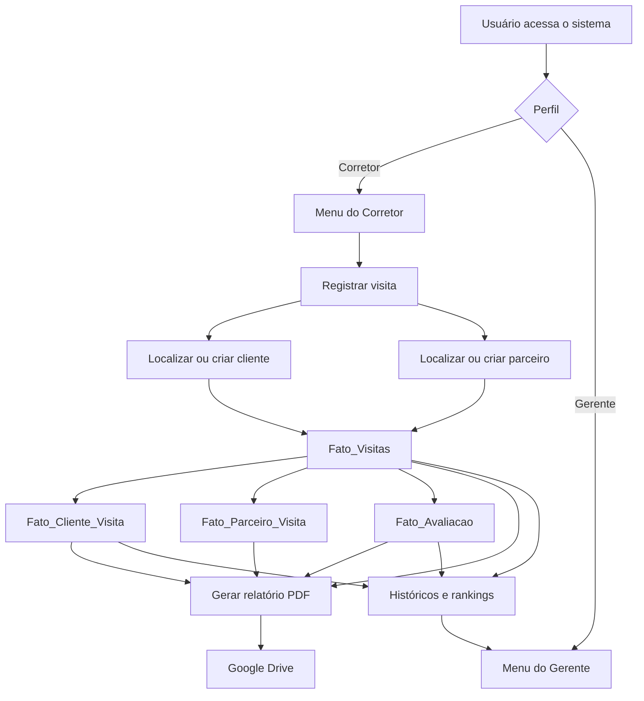

# Documentação dos Processos e Acionadores — Modelo_Visitas

**Organização:** 61 Imóveis  
**Base de referência:** `Modelo_Visitas`  
**Data de referência do painel:** 14/07/2026  
**Escopo:** registro, acompanhamento, avaliação e relatório de visitas imobiliárias.

---

## 1. Identificação correta da base

Esta documentação corresponde exclusivamente à base:

```text
Modelo_Visitas
```

Ela é diferente das demais planilhas mostradas no painel geral de acionadores, como `Base Inteligência 61`, `Controle de Contratos 61 Imóveis 2024 OFICIAL`, `CONTROLE DE LEADS COMPRA E VENDA` e `ValoresRecebidos_Contratos61_Obsoleto`.

O painel **Meus acionadores** reúne projetos de várias planilhas da mesma conta. Por isso, uma função visível na captura não pertence automaticamente à `Modelo_Visitas`.

---

## 2. Situação dos acionadores

No inventário fornecido, não aparece nenhuma linha cujo arquivo ou projeto esteja identificado diretamente como `Modelo_Visitas`.

| Item | Situação |
|---|---|
| Base de referência | `Modelo_Visitas` |
| Projeto Apps Script próprio | Não identificado no painel |
| Acionador próprio | Não identificado no painel |
| Processos internos da base | Identificados em códigos anteriores |
| Integração com Google Sheets | Confirmada |
| Integração com Google Drive | Confirmada nos relatórios |
| Interface por corretor e gerente | Parcialmente confirmada |

Assim, funções como `mainWork`, `transferData`, `showForm`, `showMainMenu`, `importarLeadsParaPlanilha` e `verifyAndSyncFatoVendaFromVendas` não devem ser atribuídas à `Modelo_Visitas` sem confirmação pelo código.

---

## 3. Objetivo da Modelo_Visitas

A base organiza o ciclo de uma visita imobiliária:

1. identificação do corretor;
2. cadastro ou localização do cliente;
3. cadastro ou localização de parceiro;
4. registro da visita;
5. vínculo entre visita e participantes;
6. avaliação do imóvel;
7. armazenamento de ficha, áudio, imagem e assinatura;
8. consulta de histórico;
9. geração de relatório em PDF;
10. gravação do relatório no Google Drive;
11. produção de indicadores e rankings.

---

## 4. Estrutura de dados

### 4.1. `Dim_Corretor`

Identifica o corretor responsável pelas visitas e pelos clientes.

Campos conhecidos:

- `IdCorretor`;
- nome;
- e-mail;
- telefone;
- Instagram;
- descrição;
- vínculo com gerente, quando utilizado.

**Chave recomendada:** `IdCorretor`.

---

### 4.2. `Dim_Cliente_Visita`

| Coluna | Campo |
|---|---|
| A | `Id_Cliente` |
| B | nome do cliente |
| C | telefone |
| D | e-mail |
| E | `CreatedBy` |
| F | `Id_Corretor` |

Processo conhecido:

1. receber os dados do cliente;
2. normalizar o nome;
3. procurar cadastro existente;
4. reutilizar o ID quando encontrado;
5. gerar novo ID no padrão `CL` + 6 caracteres;
6. gravar o cliente e vinculá-lo ao corretor.

**Risco:** a busca somente por nome pode confundir pessoas homônimas. A deduplicação deve considerar também o telefone ou e-mail.

---

### 4.3. `Dim_Parceiro_Visita`

| Coluna | Campo |
|---|---|
| A | `Id_Parceiro` |
| B | `Nome_Parceiro` |
| C | `Imobiliaria` |
| D | `Id_Corretor` |

O processo reutiliza o parceiro existente ou gera um ID no padrão `P` + 7 caracteres.

**Regra recomendada:** comparar nome normalizado e imobiliária, e não somente o nome.

---

### 4.4. `Fato_Visitas`

Tabela principal, com intervalo conhecido `A:R`.

| Coluna | Campo |
|---|---|
| A | `Id_Visita` |
| B | `Id_Imovel` |
| C | `Data_Visita` |
| D | `Id_Corretor` |
| E | `Anexo_Ficha_Visita` |
| F | `AudiodescricaoClienteVisita` |
| G | `Link_Audio` |
| H | `Link_Imagem` |
| I | `Visita_Com_Parceiro` |
| J | `Tipo_Captacao` |
| K | `Endereco_Externo` |
| L | `Proposta` |
| M | `CreatedAt` |
| N | `CreatedBy` |
| O | `Assinatura` |
| P | `Id_Cliente_Assinante` |
| Q | `Id_Parceiro` |
| R | `Imovel_Nao_Captado` |

**Chave:** `Id_Visita`.

Regras:

- a visita deve possuir data e corretor;
- imóvel captado deve utilizar `Id_Imovel`;
- imóvel não captado pode utilizar `Endereco_Externo`;
- visita com parceiro deve possuir parceiro relacionado;
- links devem apontar para arquivos acessíveis;
- a reexecução do envio não pode duplicar a visita.

---

### 4.5. `Fato_Cliente_Visita`

| Coluna | Campo |
|---|---|
| A | identificador da relação |
| B | `Id_Visita` |
| C | `Id_Cliente` |
| D | `Papel_Visita` |

Permite que uma visita tenha vários clientes e que um cliente participe de várias visitas.

**Unicidade recomendada:**

```text
Id_Visita + Id_Cliente + Papel_Visita
```

---

### 4.6. `Fato_Parceiro_Visita`

| Coluna | Campo |
|---|---|
| A | identificador da relação |
| B | `Id_Visita` |
| C | `Id_Parceiro` |

**Unicidade recomendada:**

```text
Id_Visita + Id_Parceiro
```

---

### 4.7. `Fato_Avaliacao`

| Coluna | Campo |
|---|---|
| A | `id_Avaliacao` |
| B | `Id_Visita` |
| C | `Id_Cliente` |
| D | `Localizacao` |
| E | `Tamanho` |
| F | `Planta_Imovel` |
| G | `Qualidade_Acabamento` |
| H | `Estado_Conservacao` |
| I | `Condominio_AreaComun` |
| J | `Preco` |
| K | `Nota_Geral` |
| L | `Preco_N10` |
| M | `CreatedBy` |
| N | `Id_Parceiro` |

Essa tabela registra a percepção do cliente sobre o imóvel e permite calcular médias por critério.

---

## 5. Processo de registro da visita

Função conhecida:

```text
registrar_visita(payload)
```

Esse processo não foi identificado como acionador no painel. Ele pertence à camada de aplicação ou backend.

### Etapas

1. receber os dados enviados pela interface;
2. conectar-se ao Google Sheets e ao Google Drive;
3. gerar IDs para visita, avaliação e relacionamentos;
4. converter a data para `DD/MM/YYYY`;
5. identificar o corretor;
6. classificar a situação do imóvel;
7. localizar ou criar parceiro;
8. localizar ou criar cliente;
9. localizar ou criar cliente assinante;
10. gravar a linha em `Fato_Visitas`;
11. gravar a avaliação em `Fato_Avaliacao`;
12. gravar o vínculo em `Fato_Cliente_Visita`;
13. gravar o vínculo em `Fato_Parceiro_Visita`, quando houver;
14. retornar o `Id_Visita`.

### Classificação do imóvel

| Situação | Resultado |
|---|---|
| Captação própria | `Tipo_Captacao = "Captação Própria"` |
| Captação de parceiro | `Tipo_Captacao = "Captação Parceiro"` |
| Imóvel não captado | `Imovel_Nao_Captado = TRUE` |

### Risco de gravação parcial

Como o processo grava em várias abas, uma falha intermediária pode gerar:

- visita sem avaliação;
- visita sem cliente;
- avaliação sem relacionamento;
- parceiro sem vínculo;
- relatório incompleto.

Recomenda-se registrar status `INICIADA`, `CONCLUÍDA` ou `ERRO` por `Id_Visita`.

---

## 6. Processo de consulta das visitas do corretor

Função conhecida:

```text
buscar_visitas_do_corretor(id_corretor, q, limit)
```

Fontes:

- `Fato_Visitas`;
- `Fato_Cliente_Visita`;
- `Dim_Cliente_Visita`.

Fluxo:

1. receber o ID do corretor;
2. ler visitas e vínculos;
3. filtrar somente as visitas do corretor;
4. resolver o nome do cliente;
5. montar um rótulo com cliente, data e imóvel;
6. aplicar busca textual;
7. ordenar pelas visitas mais recentes;
8. limitar a quantidade retornada.

Saída típica:

```json
{
  "id_visita": "...",
  "cliente": "...",
  "dataVisita": "...",
  "imovelId": "...",
  "label": "..."
}
```

---

## 7. Processo de gestão dos clientes

### 7.1. Listagem

```text
listar_clientes_do_corretor(id_corretor)
```

Retorna ID, nome, telefone e e-mail dos clientes vinculados ao corretor.

### 7.2. Cadastro manual

```text
criar_cliente_manual(nome, telefone, email, created_by, id_corretor)
```

Reutiliza a lógica de localizar ou criar cliente.

### 7.3. Histórico

```text
buscar_clientes_do_corretor_com_historico(id_corretor, q, limit)
```

Retorna:

- cliente;
- quantidade de visitas;
- última data;
- imóveis visitados;
- IDs das visitas;
- dados de contato.

---

## 8. Processo de avaliação

A avaliação é recebida junto com o registro da visita.

Critérios conhecidos:

- localização;
- tamanho;
- planta;
- acabamento;
- conservação;
- condomínio ou área comum;
- preço;
- nota geral;
- preço nota 10.

Controles recomendados:

- validar a escala das notas;
- validar `Preco_N10` como valor monetário;
- permitir várias avaliações na mesma visita quando houver mais de um cliente;
- impedir avaliação sem visita;
- registrar o usuário responsável.

---

## 9. Processo de geração do PDF da visita

O relatório consolida informações de:

- `Fato_Visitas`;
- `Fato_Avaliacao`;
- `Dim_Cliente_Visita`;
- `Fato_Cliente_Visita`;
- `Dim_Corretor`;
- `Dim_Parceiro_Visita`;
- `Fato_Parceiro_Visita`.

Conteúdo:

- identificação da visita;
- data e imóvel;
- tipo de captação;
- proposta;
- corretor;
- clientes;
- parceiros;
- avaliações;
- ficha;
- áudio;
- imagem;
- assinatura;
- médias das avaliações;
- preço médio considerado nota 10.

Saída:

- arquivo PDF;
- gravação no Google Drive;
- ID do arquivo;
- link de visualização;
- caminho de armazenamento.

---

## 10. Processo de relatório do cliente

O relatório do cliente consolida:

- cadastro;
- quantidade de visitas;
- imóveis visitados;
- datas;
- propostas;
- parceiros;
- avaliações;
- links para fichas e relatórios.

Fontes:

- `Dim_Cliente_Visita`;
- `Fato_Cliente_Visita`;
- `Fato_Visitas`;
- `Fato_Avaliacao`;
- tabelas de parceiro.

---

## 11. Interface por perfil

### Corretor

Pode acessar:

- registro de visita;
- clientes;
- histórico;
- relatório da visita;
- relatório do cliente;
- ranking.

### Gerente

Pode acessar:

- visitas totais;
- clientes totais;
- visitas da semana;
- ranking por corretor;
- relatório do corretor;
- relatório das visitas;
- links das fichas no Drive.

A identificação pode ocorrer pelo e-mail do usuário, relacionando-o à `Dim_Corretor` ou à dimensão de gerentes.

---

## 12. Indicadores

- total de visitas;
- visitas por corretor;
- visitas por gerente;
- visitas por equipe;
- visitas por período;
- visitas da semana;
- clientes atendidos;
- imóveis visitados;
- visitas com parceiro;
- visitas por tipo de captação;
- imóveis não captados;
- propostas;
- nota média;
- média por critério;
- preço médio nota 10;
- visitas sem ficha;
- visitas sem assinatura;
- visitas sem avaliação.

O ranking deve utilizar `Id_Corretor` como chave e buscar o nome oficial na `Dim_Corretor`.

---

## 13. Fluxo consolidado



---

## 14. Dependências e riscos

| Dependência ou risco | Impacto |
|---|---|
| Cabeçalho alterado | Falha de leitura ou gravação |
| Token OAuth ausente ou expirado | Sheets e Drive indisponíveis |
| Pasta sem permissão | PDF não salvo |
| Cliente duplicado | Histórico dividido |
| ID de corretor inexistente | Visita sem responsável |
| ID de imóvel inválido | Visita sem referência |
| Gravação parcial | Relacionamentos incompletos |
| Reenvio do formulário | Visita duplicada |
| E-mail não cadastrado | Perfil ou filtro incorreto |
| Nota fora do padrão | Indicadores inválidos |

---

## 15. Validações de integridade

Verificar periodicamente:

```text
Fato_Visitas.Id_Corretor existe em Dim_Corretor
Fato_Cliente_Visita.Id_Visita existe em Fato_Visitas
Fato_Cliente_Visita.Id_Cliente existe em Dim_Cliente_Visita
Fato_Parceiro_Visita.Id_Visita existe em Fato_Visitas
Fato_Parceiro_Visita.Id_Parceiro existe em Dim_Parceiro_Visita
Fato_Avaliacao.Id_Visita existe em Fato_Visitas
```

Também identificar visitas:

- sem data;
- sem corretor;
- sem cliente;
- sem imóvel e sem endereço externo;
- com parceiro marcado e sem parceiro;
- sem `CreatedAt`;
- sem `CreatedBy`.

---

## 16. Padrão de logs recomendado

```text
INÍCIO | processo=registrar_visita
VISITA | id=...
CORRETOR | id=...
CLIENTE | id=...
PARCEIRO | id=...
FATO_VISITAS | status=OK
FATO_AVALIACAO | status=OK
FATO_CLIENTE_VISITA | status=OK
FATO_PARCEIRO_VISITA | status=OK
FIM | duração_ms=...
```

Em caso de erro:

```text
ERRO | processo=registrar_visita
ETAPA=Fato_Avaliacao
ID_VISITA=...
MENSAGEM=...
```

---

## 17. Inventário dos acionadores externos exibidos

Os acionadores abaixo aparecem no painel, mas não foram identificados como pertencentes à `Modelo_Visitas`.

| Base / arquivo | Projeto | Função | Taxa de erros |
|---|---|---|---:|
| Cópia de CONTROLE DE LEADS COMPRA E VENDA | PreencherBase | `onOpen` | — |
| Solicitações - 61 (Respostas) | Solicitações 61 | `mainWork` | 0% |
| CONTROLE DE QUALIDADE - 2023 | Projeto sem título | `finalizarImoveis` | 100% |
| CONTROLE DE QUALIDADE - 2023 | Projeto sem título | `verificarDocumentacoesEEnviarEmail` | 100% |
| Cópia de Base Inteligência 61 | Gestão de dados | `coletarAtendimentos` | 0% |
| Cópia de Base Inteligência 61 | Gestão de dados | `transferirDadosDaRecepcaoParaFatoLead` | 0% |
| Base Inteligência 61 | Gestão de dados | `showMainMenu` | 0% |
| Base Inteligência 61 | Gestão de dados | `verifyAndSyncFatoVendaFromVendas` | 35,71% |
| CONTROLE DE QUALIDADE - 2024 | Verificar Documentações | `verificarDocumentacoes` | 100% |
| CONTROLE DE QUALIDADE - 2024 | Verificar Documentações | `verificarDocumentacoesEEnviarEmail` | 100% |
| Cópia de CONTROLE DE LEADS COMPRA E VENDA | PreencherBase | `transferirDados` | 0% |
| Controle de Contratos 61 Imóveis 2024 OFICIAL | Projeto sem título | `transferData` | 11,11% |
| ValoresRecebidos_Contratos61_Obsoleto | Lancamento_Contratos | `showForm` | 0% |
| Teste_Respostas acelera | ETL_Form_Acelera_Teste | `executarTodasAsExtracoes` | 0% |
| CONTROLE DE LEADS COMPRA E VENDA | PreencherBase | `importarLeadsParaPlanilha` | 0% |
| CONTROLE DE LEADS COMPRA E VENDA | PreencherBase | `enviarEmailLeads` | 0% |
| CONTROLE DE LEADS COMPRA E VENDA | PreencherBase | `showMainMenu` | 0% |
| Cópia de Base Inteligência 61 | Gestão de dados | `setMenuContent` | — |

---

## 18. Como identificar os acionadores próprios

1. abrir a planilha `Modelo_Visitas`;
2. acessar **Extensões → Apps Script**;
3. registrar o nome do projeto;
4. abrir a área **Acionadores**;
5. registrar função, evento, horário e taxa de erros;
6. localizar no código:
   - `onOpen`;
   - `doGet`;
   - `doPost`;
   - `ScriptApp.newTrigger`;
   - IDs das planilhas;
   - pastas do Drive.

---

## 19. Pendências

Ainda devem ser confirmados:

- projeto Apps Script diretamente vinculado à base;
- acionadores próprios;
- horários;
- estrutura definitiva da `Dim_Corretor`;
- dimensão de gerentes;
- rotas atuais do backend;
- caminho dos PDFs no Drive;
- critérios oficiais do ranking;
- política de edição e exclusão;
- ambiente de produção;
- comportamento em gravações parciais.

---

## 20. Resumo executivo

A base de referência é `Modelo_Visitas`.

Nenhum acionador da captura foi identificado diretamente como pertencente a essa base. Por isso, os itens visíveis no painel foram classificados como externos.

Os processos conhecidos da `Modelo_Visitas` incluem cadastro de clientes e parceiros, registro de visitas, avaliações, vínculos entre participantes, históricos, geração de PDFs, armazenamento no Drive, relatórios e rankings.

Os principais pontos de atenção são a gravação em várias abas sem transação única, a deduplicação de clientes apenas por nome, a integridade dos relacionamentos e a falta de identificação dos acionadores próprios no painel apresentado.
